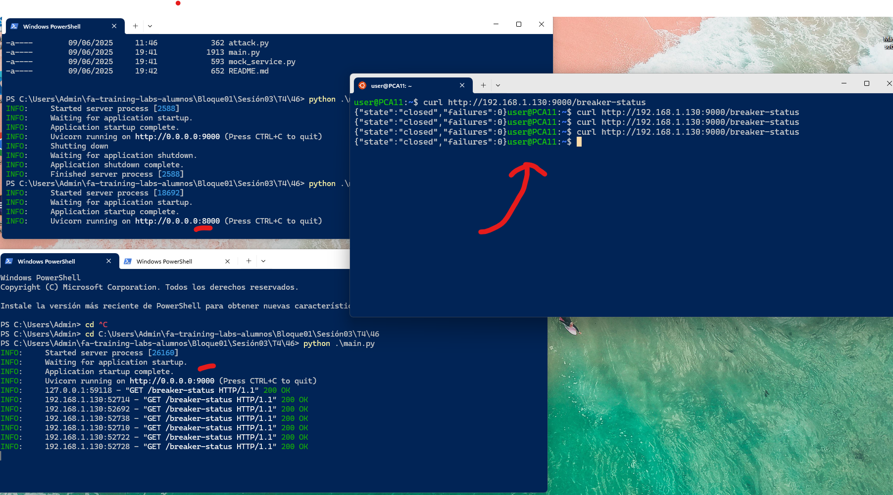

# Cómo probar el pybreaker

### Estados:
- Closed: De pasar peticiones
- Open: según configuración después de 3 intentos fallidos de acceso al servicio falla completamente 501 y nos pasa a open el circuito para no dejar pasar más peticiones.
- Halfopen: es un estado más difícil de atrapar pero funciona después de 10s de estar open sin hacer nada. Ahí pasa lo siguiente:
  - Si se hace una petición con éxito -> Closed (se supone que el servicio funciona y el circuito no funciona)
  - Si vuelve a fallar la petición -> Open (se vuelve a abrir el circuito y no se aceptan peticiones)

### Uso

- Se lanza el `mock_service`: `python mock_service.py`
- Se lanza el servicio principal: `python main.py`

- Se prueba el curl para ver el estado del circuito: 

```bash
curl http://192.168.1.130:9000/breaker-status
{"state":"closed","failures":0}
```



- Hacemos llamada exitosa: 
```bash
curl http://192.168.1.130:9000/call-external
{"status":"ok","data":{"message":"Todo OK"}}
```

- Ahora cancelamos el mock service para que falle de verdad. Y vemos cómo hacemos una petición y falla y el status también tiene un fallo.

```bash
 curl http://192.168.1.130:9000/call-external
{"detail":"Errourl http://192.168.1.130:9000/breaker-status
{"state":"closed","failures":1}
```


- Ahora lo probamos que falle 3 veces y vemos cómo el circuito se abre:

```bash
 curl http://192.168.1.130:9000/call-external
{"detail":"Servicio no disponible (Circuito Abierto)."}user@PCA11:~$ curl http://192.168.1.130:9000/call-extbreaker-status
{"state":"open","failures":3}
```

- Para ver half-open: hay que esperar 10 s después del circuito abierto y luego si haces una petición, te sale en este caso que pasa de half-open a closed para recibir peticiones.

```bash

curl http://192.168.1.130:9000/call-external
{"status":"ok","data":{"message":"Todo OK"}}user@PCA11:~$ 

curl http://192.168.1.130:9000/breaker-status
{"state":"closed","failures":0}
```


- En otro caso, si el servicio mock está abajo, entonces pasará de half-open a open.

