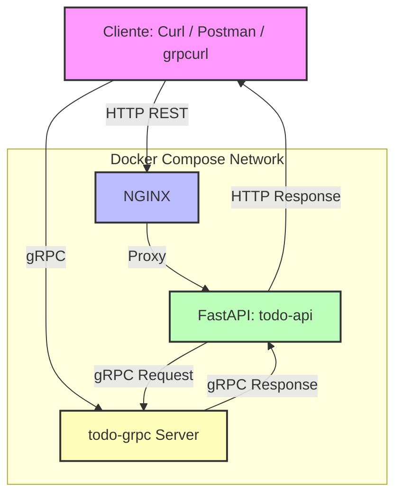
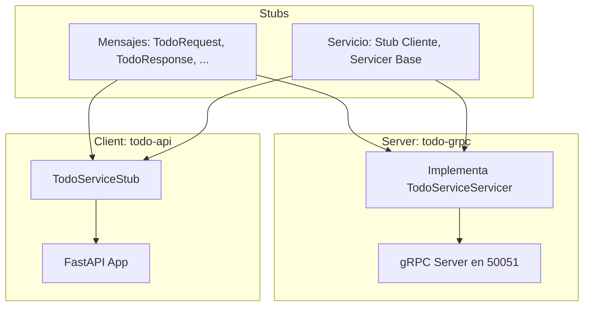

# 📚 Guía Completa del Profesor: Creación de Microservicio REST + gRPC + NGINX

---

# 🌐 **Objetivo del Proyecto**

Construir paso a paso un sistema de microservicios basado en:

* **FastAPI**: API REST como cliente gRPC.
* **gRPC**: Backend de servicios.
* **MariaDB**: Base de datos.
* **NGINX**: Reverse proxy REST + gRPC.

Progresivamente validaremos el proyecto usando cURL, Postman y clientes gRPC.

---

# 🏙️ **Estructura del Proyecto**

```
lab03-fastapi-grpc-todo-app/
├── .env
├── docker-compose.yml
├── Makefile
├── nginx/
│   └── nginx.conf
├── services/
│   ├── todo-api/
│   │   ├── Dockerfile
│   │   ├── Makefile
│   │   ├── requirements.txt
│   │   └── app/
│   │       ├── config.py
│   │       ├── grpc_client_test.py
│   │       ├── main.py
│   │       ├── todo_pb2.py
│   │       ├── todo_pb2_grpc.py
│   │       └── proto/
│   │           └── todo.proto
│   ├── todo-grpc/
│   │   ├── Dockerfile
│   │   ├── Makefile
│   │   ├── requirements.txt
│   │   └── app/
│   │       ├── config.py
│   │       ├── database.py
│   │       ├── main.py
│   │       ├── models.py
│   │       ├── todo_pb2.py
│   │       ├── todo_pb2_grpc.py
│   │       └── proto/
│   │           └── todo.proto
│   ├── note-api/
│   │   ├── Dockerfile
│   │   ├── Makefile
│   │   ├── requirements.txt
│   │   └── app/
│   │       ├── config.py
│   │       ├── main.py
│   │       ├── note_pb2.py
│   │       ├── note_pb2_grpc.py
│   │       └── proto/
│   │           └── note.proto
│   └── note-grpc/
│       ├── Dockerfile
│       ├── Makefile
│       ├── requirements.txt
│       └── app/
│           ├── config.py
│           ├── database.py
│           ├── main.py
│           ├── models.py
│           ├── note_pb2.py
│           ├── note_pb2_grpc.py
│           └── proto/
│               └── note.proto
```
# Explicación

Perfecto, aquí tienes el resumen de lo que he encontrado en tu proyecto:

* `todo-api`: Servicio FastAPI que actúa como cliente gRPC.
* `todo-grpc`: Servicio gRPC que expone métodos para las operaciones de TODOs.
* Ambos tienen sus propios `Dockerfile` y están orquestados vía `docker-compose.yml`.
* Hay un `nginx` configurado, probablemente como proxy inverso.

---

### Aquí tienes un **Mermaid diagram** que explica cómo va el flujo de tu proyecto:


---

### Explicación:

1. **Cliente**: Realiza una petición HTTP (REST) hacia **NGINX**.
2. **NGINX**: Hace de **proxy inverso** y redirige el tráfico al servicio **todo-api** (FastAPI).
3. **todo-api**: Este servicio no maneja la lógica de negocio directamente, sino que actúa como **cliente gRPC**. Se conecta al **todo-grpc server** y le solicita la operación.
4. **todo-grpc**: Es el servidor que implementa el servicio gRPC donde está la lógica de manejo de TODOs.
5. **Respuesta**: El flujo de respuesta vuelve a través del mismo camino.

---

🔥 ¡Claro! Vamos a hacer una explicación **muy detallada** de **todos los ficheros** que se generan de los **stubs gRPC** y **cómo se usan** en tu proyecto:

---

# 🛠️ **¿Qué pasa cuando generas stubs en gRPC?**

Cuando tienes un archivo `.proto`, por ejemplo:

```proto
// services/todo-api/app/proto/todo.proto

syntax = "proto3";

package todo;

service TodoService {
  rpc AddTodo (TodoRequest) returns (TodoResponse);
  rpc ListTodos (Empty) returns (TodoList);
}

message TodoRequest {
  string task = 1;
}

message TodoResponse {
  bool success = 1;
}

message Empty {}

message TodoList {
  repeated string tasks = 1;
}
```

Cuando corres el **protoc**:

```bash
python -m grpc_tools.protoc \
    --proto_path=. \
    --python_out=. \
    --grpc_python_out=. \
    todo.proto
```

Se generan **dos** ficheros:

### 📝 1. `todo_pb2.py`

Este archivo contiene:

* Las **clases de los mensajes**:

  * `TodoRequest`
  * `TodoResponse`
  * `Empty`
  * `TodoList`

Estas clases son **representaciones de los datos**. Sirven para:

* **Crear objetos** de request/response en tu aplicación.
* **Serializar y deserializar** los datos bajo el protocolo Protobuf.

Por ejemplo:

```python
from todo_pb2 import TodoRequest

# Crear un mensaje de request
request = TodoRequest(task="Comprar leche")
```

---

### 📝 2. `todo_pb2_grpc.py`

Este archivo contiene:

* La **definición del servicio gRPC**.
* Las **interfaces base**:

  * `TodoServiceStub` → **Cliente**: para llamar al servicio.
  * `TodoServiceServicer` → **Servidor**: para implementar el servicio.

Ejemplo:

```python
# Cliente (todo-api)
from todo_pb2_grpc import TodoServiceStub

# Servidor (todo-grpc)
from todo_pb2_grpc import TodoServiceServicer, add_TodoServiceServicer_to_server
```

---

# 📦 **Cómo se usan en tu proyecto**

## 🚀 **En `todo-grpc` (Servidor gRPC)**

### Archivos relevantes:

* `app/server.py` (normalmente)
* `todo_pb2.py` y `todo_pb2_grpc.py`

### Flujo:

```python
# Importar stubs
import todo_pb2
import todo_pb2_grpc
import grpc
from concurrent import futures

# Implementación del Servicio
class TodoService(todo_pb2_grpc.TodoServiceServicer):
    def __init__(self):
        self.tasks = []

    def AddTodo(self, request, context):
        self.tasks.append(request.task)
        return todo_pb2.TodoResponse(success=True)

    def ListTodos(self, request, context):
        return todo_pb2.TodoList(tasks=self.tasks)

# Crear el server
def serve():
    server = grpc.server(futures.ThreadPoolExecutor(max_workers=10))
    todo_pb2_grpc.add_TodoServiceServicer_to_server(TodoService(), server)
    server.add_insecure_port('[::]:50051')
    server.start()
    server.wait_for_termination()
```

✅ Aquí:

* Implementas la lógica en `TodoService`.
* Registra el servicio con `add_TodoServiceServicer_to_server`.
* El server escucha en `50051` gRPC.

---

## 🚀 **En `todo-api` (Cliente FastAPI)**

### Archivos relevantes:

* `app/main.py`
* `todo_pb2.py` y `todo_pb2_grpc.py`

### Flujo:

```python
# Importar stubs
import grpc
import todo_pb2
import todo_pb2_grpc
from fastapi import FastAPI

app = FastAPI()

# Crear canal y cliente (stub)
channel = grpc.insecure_channel('todo-grpc:50051')
stub = todo_pb2_grpc.TodoServiceStub(channel)

@app.post("/add_todo/")
def add_todo(task: str):
    request = todo_pb2.TodoRequest(task=task)
    response = stub.AddTodo(request)
    return {"success": response.success}

@app.get("/list_todos/")
def list_todos():
    request = todo_pb2.Empty()
    response = stub.ListTodos(request)
    return {"tasks": response.tasks}
```

✅ Aquí:

* El cliente (`todo-api`) crea un **canal** hacia `todo-grpc:50051`.
* Crea un **stub** (cliente gRPC) con `TodoServiceStub`.
* Cuando alguien llama al endpoint REST `/add_todo/`, el FastAPI **traduce la petición** a un **gRPC request**.

---

# 🧩 **Resumen Visual**



---

# Prueba

```bash
 grpcurl -plaintext   -proto todo.proto  localhost:50051 todo.TodoService/GetTodos
{
  "todos": [
    {
      "id": 1,
      "title": "task1",
      "description": "description1"
    },
    {
      "id": 2,
      "title": "task2",
      "description": "description2"
    }
  ]
}
```

# 📝 **En resumen**

| Archivo                    | ¿Qué contiene?                                 | ¿Dónde se usa?     |
| -------------------------- | ---------------------------------------------- | ------------------ |
| `todo_pb2.py`              | Definiciones de mensajes (Request/Response)    | Cliente y Servidor |
| `todo_pb2_grpc.py`         | Definiciones de servicio (Stub, Servicer Base) | Cliente y Servidor |
| **Servidor (`todo-grpc`)** | Implementa los métodos del servicio            | Usa Servicer Base  |
| **Cliente (`todo-api`)**   | Crea el stub y llama métodos remotos           | Usa Stub           |


# Actividad planteada

- Crear un nuevo servicio e integrarlo en el propio todo.proto:

- Nombre servicio: UserService
- Procedimientos:
  1. CreateUser:
    - Entrada: CreateUserRequest (username, emal)
    - Salida: CreateUserResponse (id)
  2. GetUser:
    - Entrada GetUserRequest (id)
    - Salida GetUserResponse (id, username, email)

> Por simplicidad no haremos orm así que en nuestro servidor usaríamos una simulación del crud.


```python
import grpc
from concurrent import futures
import todo_pb2
import todo_pb2_grpc

class TodoService(todo_pb2_grpc.TodoServiceServicer):
    # Implementación actual del servicio de TODOs con SQLAlchemy
    ...

class UserService(todo_pb2_grpc.UserServiceServicer):
    def __init__(self):
        self.users = []
        self.next_id = 1

    def CreateUser(self, request, context):
        user = {
            "id": self.next_id,
            "username": request.username,
            "email": request.email
        }
        self.users.append(user)
        self.next_id += 1
        return todo_pb2.CreateUserResponse(id=user["id"])

    def GetUser(self, request, context):
        for user in self.users:
            if user["id"] == request.id:
                return todo_pb2.GetUserResponse(
                    id=user["id"],
                    username=user["username"],
                    email=user["email"]
                )
        context.set_code(grpc.StatusCode.NOT_FOUND)
        context.set_details('User not found')
        return todo_pb2.GetUserResponse()


```