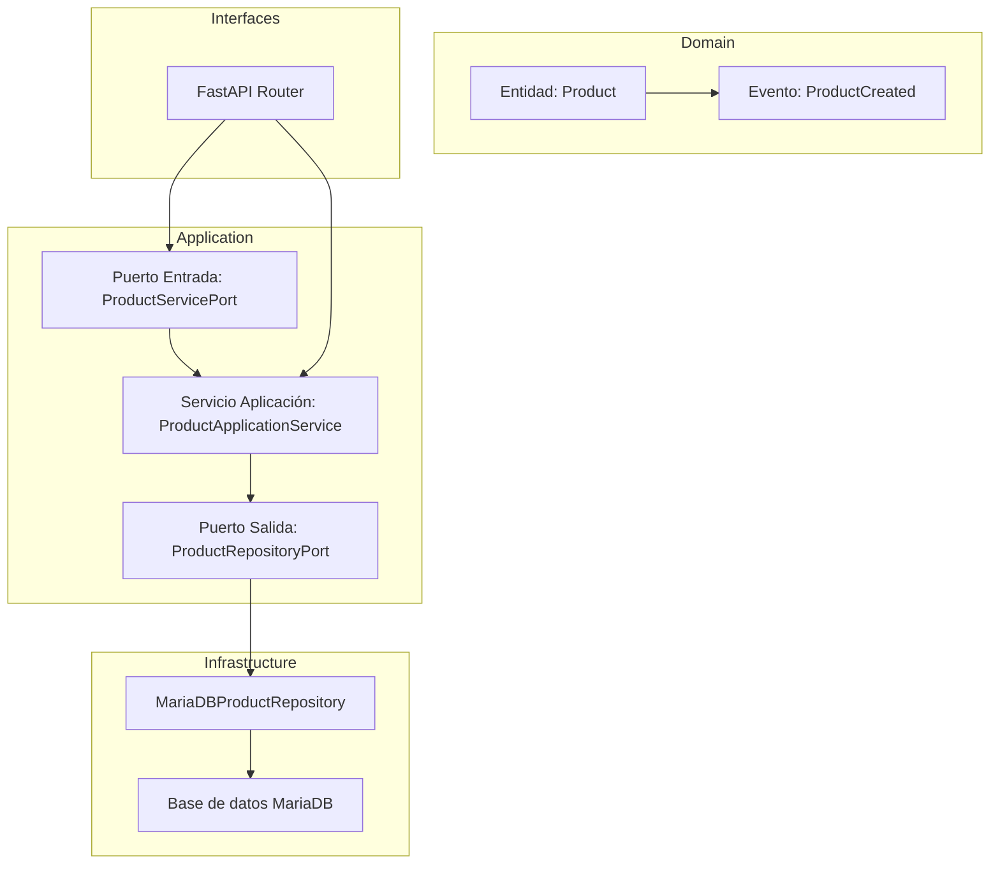

## 🎯 Enunciado del problema

Construiremos un microservicio de productos con **Arquitectura Hexagonal** en FastAPI. Este servicio permitirá:

* Crear un producto
* Listar todos los productos

Aplicaremos una separación rigurosa entre dominio, puertos, infraestructura y adaptadores de entrada (FastAPI).

---

## 📐 Diagrama de Arquitectura Hexagonal

