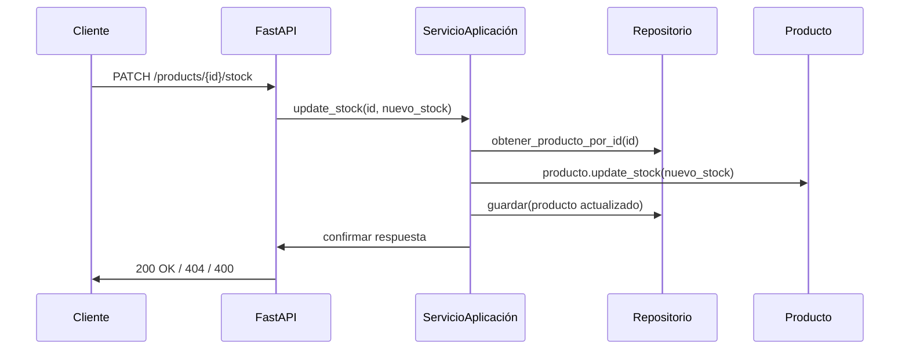

# 🎯 Reto del Alumno: Extensión del Microservicio de Productos (Tema 6)

## 🧩 Contexto

Partiendo del microservicio de productos desarrollado por el profesor, con arquitectura hexagonal y funcionalidad básica de creación y listado de productos, te proponemos un reto para aplicar los principios aprendidos.

---

## 🧪 Objetivo del reto

Implementar una **nueva funcionalidad de actualización de stock** para productos existentes, incluyendo:

* Creación del caso de uso en la capa de aplicación
* Puerto de entrada en `ProductServicePort`
* Endpoint REST `PATCH /products/{id}/stock`
* Validación de stock no negativo
* Uso de eventos de dominio si se detecta una baja significativa de stock (opcional extra)

---

## 🧩 Casos de uso esperados



---

## 🧠 Requisitos técnicos

1. Agrega un método en `ProductServicePort`:

```python
async def update_stock(product_id: UUID, new_stock: int) -> ProductDTO: ...
```

2. Implementa la lógica en `ProductApplicationService`.
3. Añade método `update_stock()` en la entidad `Product`:

```python
    def update_stock(self, new_stock: int):
        if new_stock < 0:
            raise ValueError("El stock no puede ser negativo")
        self.stock = new_stock
```

4. Añade un nuevo endpoint en FastAPI:

```python
@router.patch("/{product_id}/stock")
async def update_stock(...): ...
```

5. Prueba con curl:

```bash
curl -X PATCH http://localhost:8000/products/<uuid>/stock \
  -H "Content-Type: application/json" \
  -d '{"new_stock": 15}'
```

---

## ✅ Criterios de evaluación

* Se respeta la separación de capas hexagonal
* Se actualiza correctamente el stock en la DB
* La validación es robusta (no permite stock negativo)
* El endpoint responde con errores adecuados (404, 400, etc.)
* Se siguen buenas prácticas de diseño

---