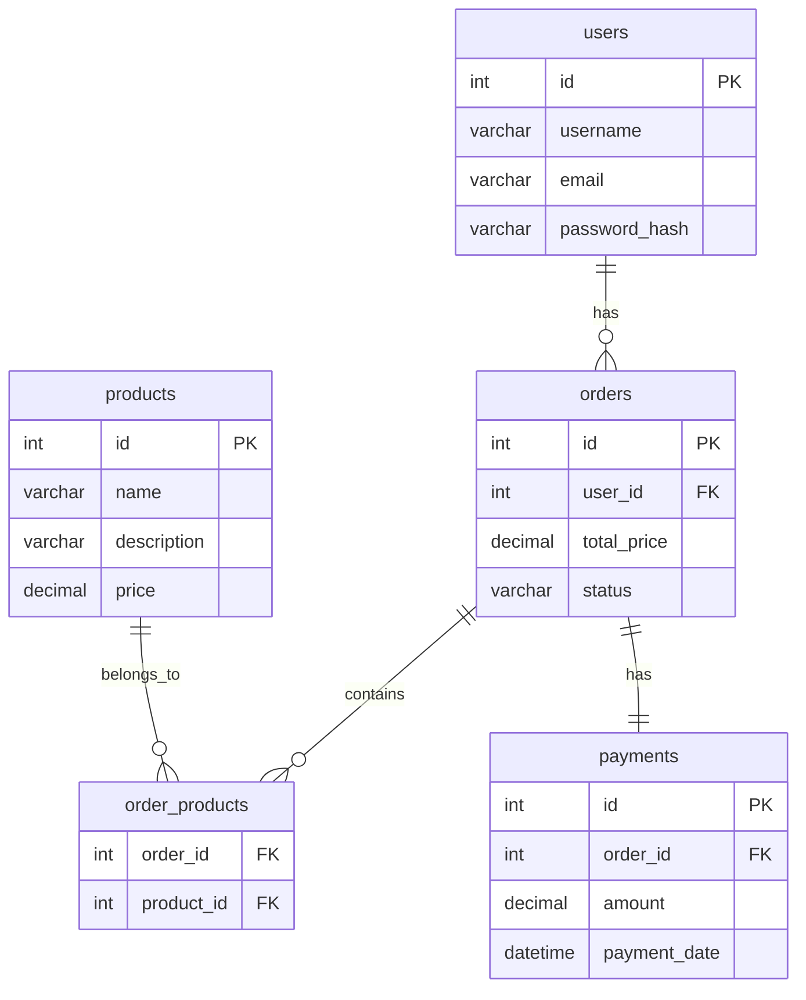
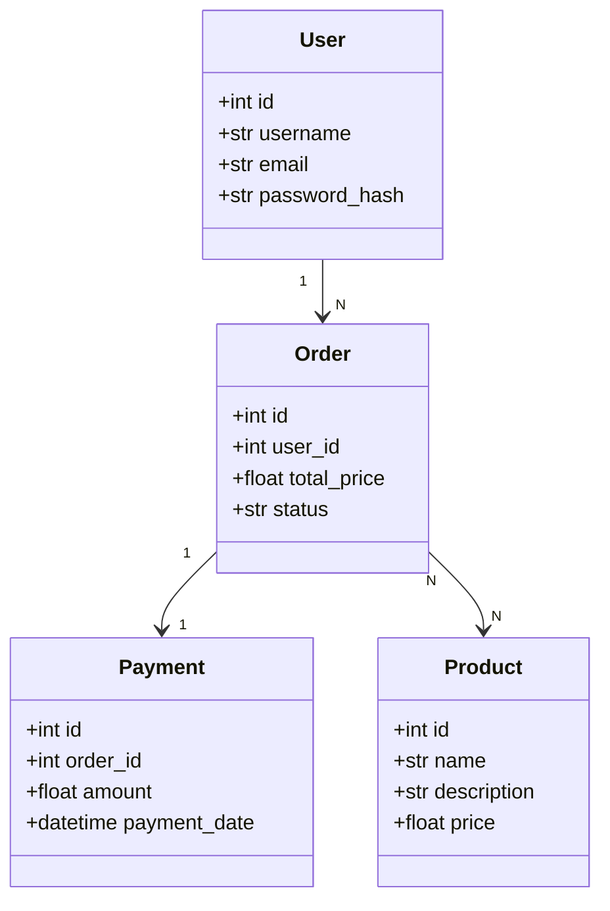
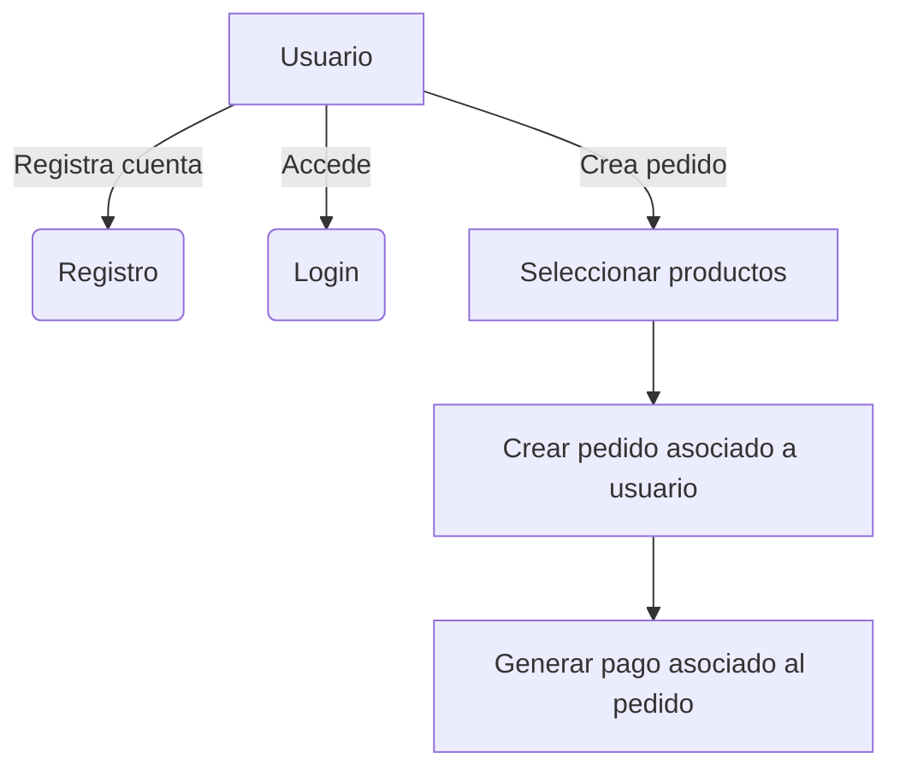
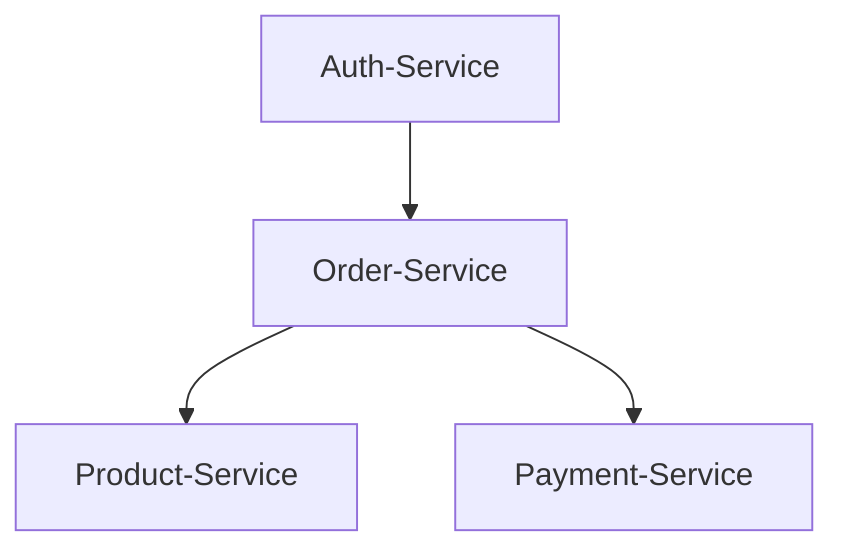
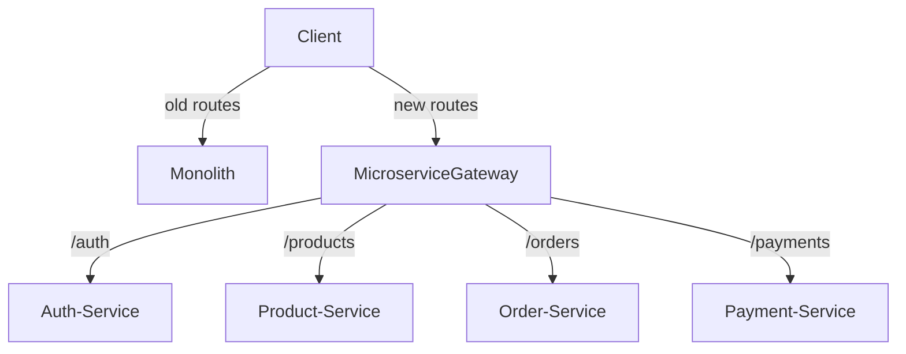
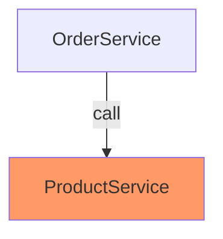
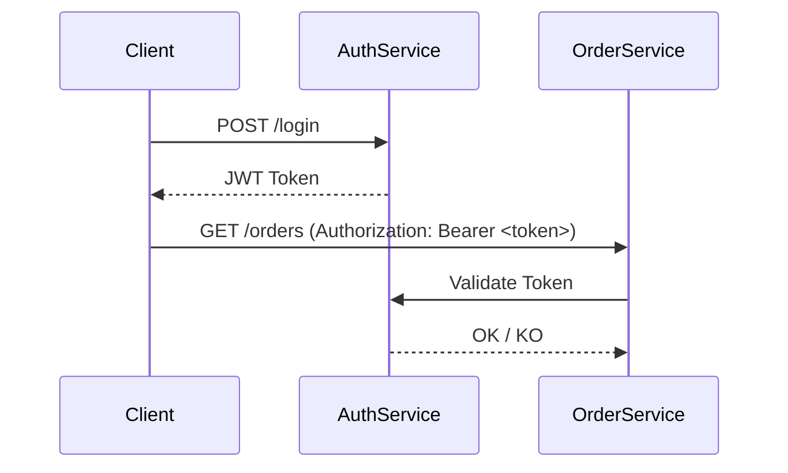

# LAB 1 - Aplicación Monolítica de Gestión de Usuarios, Productos, Pedidos y Pagos


## Enunciado

En este laboratorio se parte de una aplicación monolítica construida con **FastAPI**:

- Usuarios (registro, autenticación).
- Productos (gestión de catálogo).
- Pedidos (creación de pedidos asociando productos).
- Pagos (registro de pagos sobre pedidos).

Este monolito simula una aplicación real donde los distintos dominios de negocio están acoplados, pero listos para ser desacoplados en microservicios en fases posteriores.

---

### Diagrama Entidad-Relación (ERD)



---

### Diagrama de Clases



---

###  Casos de Uso



---

##  Stack Tecnológico 

|     Herramienta    | Descripción                       |
| :----------------: | :-------------------------------- |
|     **FastAPI**    | Framework API Web ultra rápido    |
|   **SQLAlchemy**   | ORM para modelado de datos        |
|     **MariaDB**    | Base de datos relacional          |
| **Docker Compose** | Orquestación de contenedores      |
|    **Makefile**    | Automatización de tareas          |
| **Pytest + httpx** | Testing asincrónico para APIs     |
|    **Pydantic**    | Validación de datos y esquemas    |
|       **JWT**      | Autenticación basada en tokens    |
|    **Gunicorn**    | Servidor ASGI para producción     |
|      **NGINX**     | API Gateway, Reverse Proxy, HTTPS |
|    **PyBreaker**   | Circuit Breaker para resiliencia  |

---

## Estructura de Carpetas

```
mi_monolito/
├── app/
│   ├── main.py              # Punto de entrada FastAPI
│   ├── core/                 # Configuraciones (BaseSettings)
│   ├── api/v1/                # Routers organizados por dominio
│   ├── db/                    # Modelos ORM, conexión DB y operaciones CRUD
│   ├── schemas/               # Modelos de validación Pydantic
│   ├── services/              # Lógica de negocio de cada módulo
├── db/
│   └── init.sql               # Script SQL de inicialización y dummy data
├── tests/                      # Pruebas automáticas (pytest)
├── Dockerfile                  # Imagen Docker de FastAPI
├── docker-compose.yml          # Orquestación de contenedores
├── Makefile                     # Comandos de automatización
├── requirements.txt             # Dependencias del proyecto
└── README.md                     # Esta documentación
```

---

### 📂 Explicación de Carpetas y Archivos

| Carpeta/Archivo      | Finalidad                                              |
| :------------------- | :----------------------------------------------------- |
| `app/main.py`        | Inicializa FastAPI, incluye routers.                   |
| `app/core/`          | Configuración de entornos, conexión DB.                |
| `app/api/v1/`        | Endpoints RESTful organizados por versión y dominio.   |
| `app/db/`            | Modelos de base de datos (SQLAlchemy), conexión, CRUD. |
| `app/schemas/`       | Validaciones y serialización de datos (Pydantic).      |
| `app/services/`      | Lógica de negocio independiente de framework.          |
| `db/init.sql`        | Creación de base de datos y datos dummy iniciales.     |
| `tests/`             | Tests para validar endpoints.                          |
| `Dockerfile`         | Imagen Docker para el despliegue de la app.            |
| `docker-compose.yml` | Levantar app + base de datos + redes.                  |
| `Makefile`           | Facilita `up`, `down`, `test`, `rebuild`.              |
| `requirements.txt`   | Librerías necesarias para el proyecto.                 |

---

## 🧩 Instalación y Uso

1. **Clonar el repositorio:**

```bash
git clone https://github.com/docenciait/fa-training-labs-alumnos.git
cd fa-training-labs-alumnos/Bloque1/Ses1/lab1-inicial/
```

2. **Levantar el entorno con Makefile:**

```bash
make up
```

* Compila y levanta `FastAPI` y `MariaDB`.
* Expondrá FastAPI en `http://localhost:8000/docs`.

3. **Ejecutar Tests:**

```bash
make test
```

4. **Apagar entorno:**

```bash
make down
```

5. **Reiniciar completamente entorno limpio:**

```bash
make rebuild
```

---


#  **PLAN DE MIGRACIÓN A MICROSERVICIOS**


#  **Objetivo General**

➔ Migrar un sistema **monolítico** (FastAPI + SQLAlchemy) a una arquitectura de **microservicios** desacoplada y escalable.

➔ Aplicar patrones industriales:

* **Strangler Fig** para migración progresiva.
* **Comunicación síncrona** (REST API) y **asíncrona** (mensajería).
* **API Gateway** con NGINX.
* **Circuit Breakers** para resiliencia.
* **JWT Authentication** para seguridad.

---

# 🗂️ **Índice de Trabajo**

| Paso | Descripción                                                                                             |
| :--- | :------------------------------------------------------------------------------------------------------ |
| 1.   | Identificar los **Bounded Contexts**.                                                                   |
| 2.   | Separar en **4 microservicios**: `auth-service`, `product-service`, `order-service`, `payment-service`. |
| 3.   | Crear APIs REST independientes por microservicio.                                                       |
| 4.   | Aplicar **Patrón Strangler Fig** para migración progresiva.                                             |
| 5.   | Configurar **NGINX API Gateway** con HTTPS y Reverse Proxy.                                             |
| 6.   | Configurar **Middlewares y Seguridad** en FastAPI.                                                      |
| 7.   | Implementar **Circuit Breaker** con PyBreaker.                                                          |
| 8.   | Implementar **Autenticación JWT básica**.                                                               |

---

# 1️⃣ **Identificar los Bounded Contexts**

---

📚 **Definición**:
Un **Bounded Context** es un límite conceptual dentro del dominio donde un modelo específico es definido y aplicable.

🎯 **Nuestro Dominio Actual**:

| Dominio       | Descripción                         |
| :------------ | :---------------------------------- |
| **Usuarios**  | Registro, login, autenticación JWT. |
| **Productos** | Catálogo de productos.              |
| **Pedidos**   | Gestión de pedidos de usuarios.     |
| **Pagos**     | Procesamiento de pagos de pedidos.  |

---

🖼️ **Diagrama de Bounded Contexts**



---

# 2️⃣ **Separar en Microservicios**

---

| Microservicio       |            Responsabilidad            |   Base de Datos  |
| :------------------ | :-----------------------------------: | :--------------: |
| **auth-service**    |       Registro, login, JWT auth       | PostgreSQL/MySQL |
| **product-service** |           CRUD de productos           | PostgreSQL/MySQL |
| **order-service**   | CRUD de pedidos, asignación productos | PostgreSQL/MySQL |
| **payment-service** |    Procesamiento y gestión de pagos   | PostgreSQL/MySQL |

✅ Cada microservicio:

* Tendrá su propio **Dockerfile**.
* Tendrá su propia **base de datos** (autonomía).
* Tendrá su propio **API**.
* Comunicación mediante **REST** inicialmente.

---

# 3️⃣ **Definir APIs REST Independientes**

---

📚 **Ejemplo de Endpoints**

| Microservicio     | Endpoints                                                      |
| :---------------- | :------------------------------------------------------------- |
| `auth-service`    | `POST /register`, `POST /login`, `GET /profile`                |
| `product-service` | `POST /products`, `GET /products`, `GET /products/{id}`        |
| `order-service`   | `POST /orders`, `GET /orders`, `POST /orders/{id}/add_product` |
| `payment-service` | `POST /payments`, `GET /payments`, `GET /payments/{id}`        |

---

# 4️⃣ **Aplicar Patrón Strangler Fig**

---

📚 **Definición**:
Migrar progresivamente el Monolito → Microservicios **sin apagar** el sistema completo.

🖼️ **Diagrama de Estrangulamiento**



**Proceso**:

1. Redirigir nuevas rutas al microservicio.
2. Mantener otras en el Monolito.
3. Ir estrangulando parte por parte.

---

# 5️⃣ **Configurar API Gateway con NGINX**

---

🎯 **Qué haremos**:

* Montar un contenedor **NGINX**.
* Configurar Reverse Proxy.
* Configurar **HTTPS** (certificados locales o Let's Encrypt).
* Redirigir tráfico basado en rutas:

  * `/auth/*` → `auth-service`
  * `/products/*` → `product-service`
  * `/orders/*` → `order-service`
  * `/payments/*` → `payment-service`

---

# 6️⃣ **Configurar Middlewares y Seguridad en FastAPI**

---

🎯 **Qué haremos en cada microservicio**:

* **CORS Policies** restrictivas.
* **BaseSettings** (`pydantic-settings`) para variables de entorno.
* **Gunicorn** como servidor de alto rendimiento (para producción).
* **Documentación OpenAPI** automática.

---

# 7️⃣ **Implementar Circuit Breaker con PyBreaker**

---

🎯 **Qué haremos**:

* Añadir **Circuit Breaker** para llamadas entre microservicios.
* Usar **PyBreaker**.
* Configurar retry y fallback policies.

🖼️ **Diagrama**



---

# 8️⃣ **Implementar Autenticación JWT Básica**

---

🎯 **Qué haremos**:

* Registro y login (`auth-service`).
* Generación de **JWT tokens**.
* Protección de rutas con validación de tokens.

📚 **Flujo de Autenticación**



---


