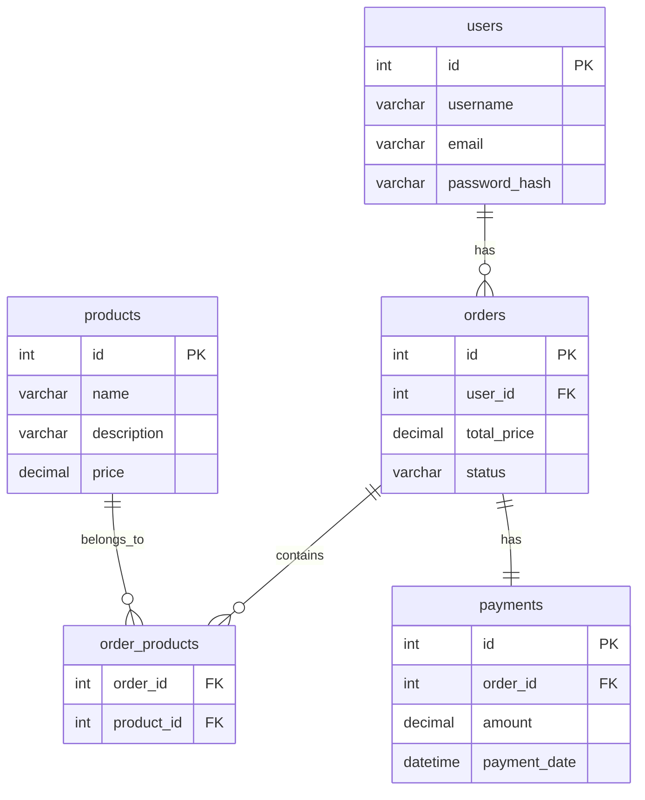
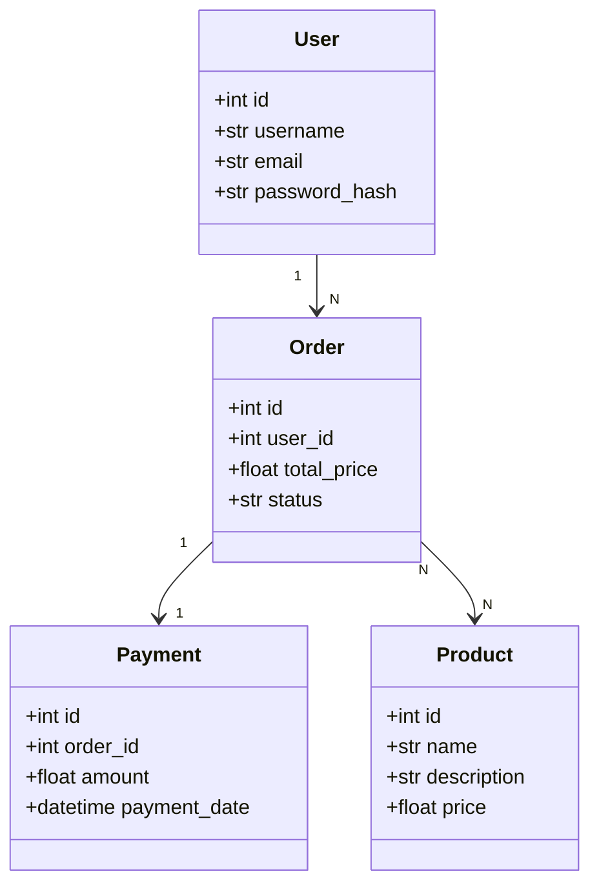
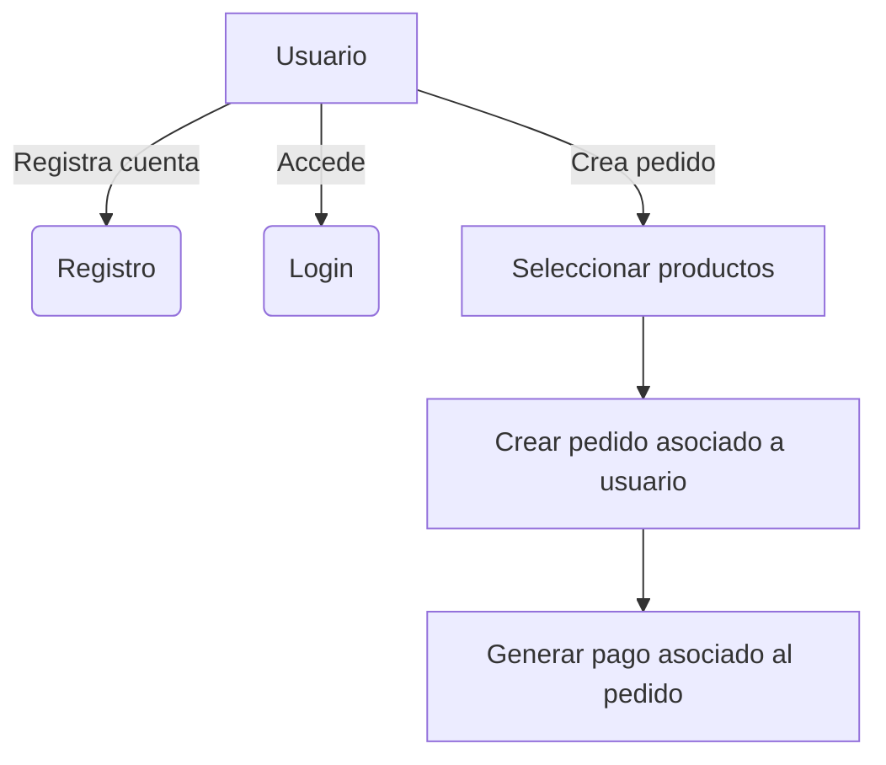

# lab01-inicial

# LAB 1 - Aplicación Monolítica de Gestión de Usuarios, Productos, Pedidos y Pagos

## Enunciado

En este laboratorio se parte de una aplicación monolítica construida con **FastAPI**:

- Usuarios (registro, autenticación).
- Productos (gestión de catálogo).
- Pedidos (creación de pedidos asociando productos).
- Pagos (registro de pagos sobre pedidos).

Este monolito simula una aplicación real donde los distintos dominios de negocio están acoplados, pero listos para ser desacoplados en microservicios en fases posteriores.

---

### Diagrama Entidad-Relación (ERD)



---

### Diagrama de Clases



---

###  Casos de Uso



---

##  Stack Tecnológico 

|     Herramienta    | Descripción                       |
| :----------------: | :-------------------------------- |
|     **FastAPI**    | Framework API Web ultra rápido    |
|   **SQLAlchemy**   | ORM para modelado de datos        |
|     **MariaDB**    | Base de datos relacional          |
| **Docker Compose** | Orquestación de contenedores      |
|    **Makefile**    | Automatización de tareas          |
| **Pytest + httpx** | Testing asincrónico para APIs     |
|    **Pydantic**    | Validación de datos y esquemas    |
|       **JWT**      | Autenticación basada en tokens    |
|    **Gunicorn**    | Servidor ASGI para producción     |
|      **NGINX**     | API Gateway, Reverse Proxy, HTTPS |
|    **PyBreaker**   | Circuit Breaker para resiliencia  |

---

## Estructura de Carpetas

```
mi_monolito/
├── app/
│   ├── main.py              # Punto de entrada FastAPI
│   ├── core/                 # Configuraciones (BaseSettings)
│   ├── api/v1/                # Routers organizados por dominio
│   ├── db/                    # Modelos ORM, conexión DB y operaciones CRUD
│   ├── schemas/               # Modelos de validación Pydantic
│   ├── services/              # Lógica de negocio de cada módulo
├── db/
│   └── init.sql               # Script SQL de inicialización y dummy data
├── tests/                      # Pruebas automáticas (pytest)
├── Dockerfile                  # Imagen Docker de FastAPI
├── docker-compose.yml          # Orquestación de contenedores
├── Makefile                     # Comandos de automatización
├── requirements.txt             # Dependencias del proyecto
└── README.md                     # Esta documentación
```

---

### Explicación de Carpetas y Archivos

| Carpeta/Archivo      | Finalidad                                              |
| :------------------- | :----------------------------------------------------- |
| `app/main.py`        | Inicializa FastAPI, incluye routers.                   |
| `app/core/`          | Configuración de entornos, conexión DB.                |
| `app/api/v1/`        | Endpoints RESTful organizados por versión y dominio.   |
| `app/db/`            | Modelos de base de datos (SQLAlchemy), conexión, CRUD. |
| `app/schemas/`       | Validaciones y serialización de datos (Pydantic).      |
| `app/services/`      | Lógica de negocio independiente de framework.          |
| `db/init.sql`        | Creación de base de datos y datos dummy iniciales.     |
| `tests/`             | Tests para validar endpoints.                          |
| `Dockerfile`         | Imagen Docker para el despliegue de la app.            |
| `docker-compose.yml` | Levantar app + base de datos + redes.                  |
| `Makefile`           | Facilita `up`, `down`, `test`, `rebuild`.              |
| `requirements.txt`   | Librerías necesarias para el proyecto.                 |

---

## Instalación y Uso

1. **Clonar el repositorio:**

```bash
git clone https://github.com/docenciait/fa-training-labs-alumnos.git
cd fa-training-labs-alumnos/Bloque1/Ses1/lab1-inicial/
```

2. **Levantar el entorno con Makefile:**

```bash
make up
```

* Compila y levanta `FastAPI` y `MariaDB`.
* Expondrá FastAPI en `http://localhost:8000/docs`.

3. **Ejecutar Tests:**

```bash
make test
```

4. **Apagar entorno:**

```bash
make down
```

5. **Reiniciar completamente entorno limpio:**

```bash
make rebuild
```

---

## Tareas

- Analizar la aplicación monolítica
- Identificar las ventajas y desventajas
- Cómo hacer una descomposición a microservicios
