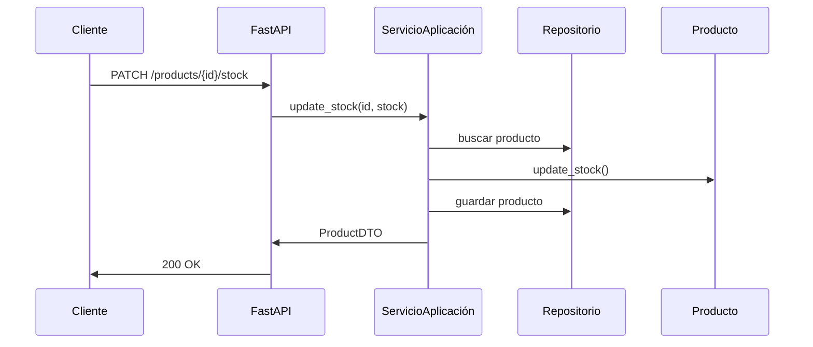

# 🔹 LAB 6 – Aplicación Hexagonal con FastAPI

| Ítem                | Detalles                                                                                                                                                                                                  |
| ------------------- | --------------------------------------------------------------------------------------------------------------------------------------------------------------------------------------------------------- |
| 🕒 **Duración**     | 2 h (puede extenderse a 2.5h con testing)                                                                                                                                                                 |
| 🎯 **Objetivo**     | Aplicar los principios de arquitectura hexagonal para diseñar una API limpia, mantenible y desacoplada                                                                                                    |
| 🧠 **Temas**        | Tema 6 completo: Arquitectura Hexagonal, Puertos y Adaptadores, DDD básico                                                                                                                                |
| ⚙️ **Tecnologías**  | FastAPI, Pydantic, pytest, Python 3.12, Docker                                                                                                                                                            |
| 📁 **Entregable**   | Aplicación funcional estructurada en capas hexagonales, con puertos bien definidos y adaptadores de entrada y salida                                                                                      |
| 🧪 **Tareas clave** | <ul><li>Definir dominio y casos de uso</li><li>Separar puertos y adaptadores</li><li>Implementar REST como adaptador de entrada</li><li>Simular un repositorio externo como adaptador de salida</li></ul> |
| 🧩 **Repositorio**  | `lab06-hexagonal-fastapi`                                                                                                                                                                                 |

---

## ✅ Enunciado del Reto del Alumno

### 🧩 Contexto

Partiendo del microservicio de productos desarrollado por el profesor, con arquitectura hexagonal y funcionalidad de creación y listado de productos, extiende su lógica para implementar:

**Una operación de actualización de stock para productos existentes**.

---

## 🎯 Objetivo

Agregar soporte para actualizar el stock de un producto mediante:

* Casos de uso en capa de aplicación
* Método en la entidad de dominio
* Puerto de entrada en `ProductServicePort`
* Endpoint PATCH `/products/{id}/stock`
* Validación de negocio (stock no negativo)

---

## 🧪 Requisitos funcionales

* Entrada:

```json
{
  "new_stock": 8
}
```

* Endpoint: `PATCH /products/{id}/stock`
* Respuesta:

```json
{
  "id": "...",
  "name": "...",
  "price": 99.99,
  "stock": 8
}
```

---

## 🧩 Requisitos técnicos

1. Añadir en `ProductServicePort`:

```python
async def update_stock(product_id: UUID, new_stock: int) -> ProductDTO: ...
```

2. Implementar la lógica en `ProductApplicationService`:

   * Recuperar el producto por ID
   * Llamar al método `update_stock()` de la entidad
   * Guardar el producto actualizado

3. Modificar `Product` para exponer:

```python
    def update_stock(self, new_stock: int):
        if new_stock < 0:
            raise ValueError("El stock no puede ser negativo")
        self.stock = new_stock
```

4. Crear el endpoint en `product_routes.py`:

```python
@router.patch("/{product_id}/stock", response_model=ProductDTO)
async def update_stock(
    product_id: UUID,
    payload: ProductStockUpdateDTO,
    service: ProductServicePort = Depends(get_product_service)
):
    return await service.update_stock(product_id, payload.new_stock)
```

---

## 📐 Diagrama de flujo


