# Arquitectura Hexagonal con FastAPI y RabbitMQ

## 📊 Objetivo del Laboratorio

Implementar una arquitectura hexagonal usando FastAPI para un productor y un consumidor que se comuniquen a través de RabbitMQ. Aplicar los principios de DDD y puertos/adaptadores en ambos servicios.

## 📒 Estructura del Proyecto

```mermaid
flowchart TD
    subgraph hex_producer
        direction TB
        P1["API REST (FastAPI)"]
        P2["Puerto de Entrada (Aplicación)"]
        P3["Servicio de Aplicación"]
        P4["Puerto de Salida"]
        P5["Adaptador RabbitMQ (pika)"]
    end

    subgraph rabbitmq ["RabbitMQ (Broker)"]
        MQ["Exchange y Cola 'eventos'"]
    end

    subgraph hex_consumer
        direction TB
        C1["Adaptador RabbitMQ (pika)"]
        C2["Puerto de Entrada"]
        C3["Servicio de Aplicación"]
        C4["Almacenamiento en Memoria"]
        C5["API REST (GET /messages)"]
    end

    P1 --> P2 --> P3 --> P4 --> P5 --> MQ
    MQ --> C1 --> C2 --> C3 --> C4 --> C5

```




```
lab94_hexagonal_rabbitmq/
├── docker-compose.yml
├── Makefile
├── producer/
│   ├── app/
│   │   ├── application/
│   │   │   ├── ports/
│   │   │   │   └── message_sender.py
│   │   │   └── services/
│   │   │       └── message_service.py
│   │   ├── domain/
│   │   │   └── models.py
│   │   ├── infrastructure/
│   │   │   └── rabbitmq_sender.py
│   │   └── interfaces/
│   │       └── api.py
│   ├── main.py
│   └── requirements.txt
├── consumer/
│   ├── app/
│   │   ├── application/
│   │   │   ├── ports/
│   │   │   │   └── message_receiver.py
│   │   │   └── services/
│   │   │       └── event_service.py
│   │   ├── domain/
│   │   │   └── models.py
│   │   ├── infrastructure/
│   │   │   └── rabbitmq_listener.py
│   │   └── interfaces/
│   │       └── api.py
│   ├── main.py
│   └── requirements.txt
```

## 🔄 Paso a Paso de Desarrollo

### 1. Definir el Dominio

* Crear en ambos servicios un modelo `Evento` en `domain/models.py`.

```python
from pydantic import BaseModel

class Evento(BaseModel):
    tipo: str
    id: str
    payload: dict
```

### 2. Diseñar los Puertos

* **Producer** define un puerto `MessageSenderPort` en `application/ports/message_sender.py`.
* **Consumer** define un puerto `MessageReceiverPort` en `application/ports/message_receiver.py`.

### 3. Implementar Servicios de Aplicación

* `MessageService` en `producer` llama al adaptador de salida RabbitMQ.
* `EventService` en `consumer` guarda los eventos recibidos.

### 4. Crear los Adaptadores de Salida

* `rabbitmq_sender.py` usa `aio_pika.connect_robust`, declara cola, y publica el mensaje.
* `rabbitmq_listener.py` se suscribe a la cola y llama al servicio de aplicación con los datos parseados.

### 5. Crear Interfaces REST

* `producer/interfaces/api.py` tiene endpoint POST `/send` que recibe el modelo Evento.
* `consumer/interfaces/api.py` tiene GET `/messages` que devuelve la lista de eventos procesados.

### 6. Integrar con FastAPI

* Cada `main.py` importa la API desde interfaces y registra `@app.on_event("startup")` para iniciar el listener en consumer.

### 7. Configurar Docker Compose

* Crear contenedor para `producer`, `consumer`, y `rabbitmq`.
* Usar red `broker-net` para que `rabbitmq` sea resolvible desde los servicios.

```yaml
networks:
  broker-net:
    driver: bridge
```

### 8. Probar con CURL

**Enviar evento:**

```bash
curl -X POST http://localhost:8001/send \
  -H "Content-Type: application/json" \
  -d '{"tipo": "CREADO", "id": "abc123", "payload": {"valor": 42}}'
```

**Consultar mensajes procesados:**

```bash
curl http://localhost:8002/messages
```

### 9. Validar en RabbitMQ UI

* Accede a `http://localhost:15672` con user/pass `guest`.
* Verifica la cola `mensajes`, los `Unacked` y los `Ready` si detienes el consumidor.

## ✅ Cierre

Este laboratorio te permite observar cómo se implementan los conceptos de arquitectura hexagonal, desacoplando el sistema de mensajería del dominio de negocio. El uso de puertos y adaptadores garantiza la testabilidad, flexibilidad y claridad del flujo de dependencias.

→ Continúa con una versión con Kafka o usando Fanout/Topic en Rabbit si quieres explorar más variantes.
