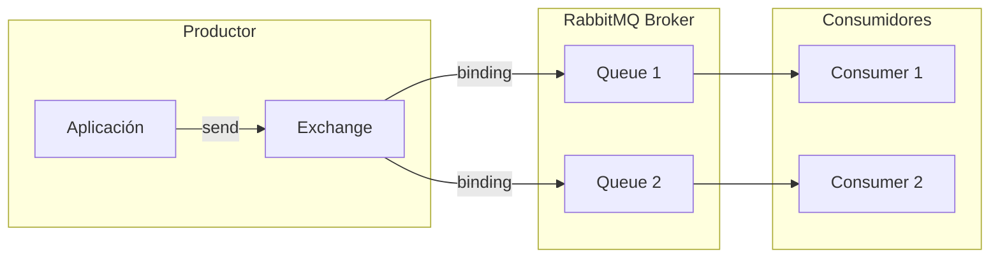
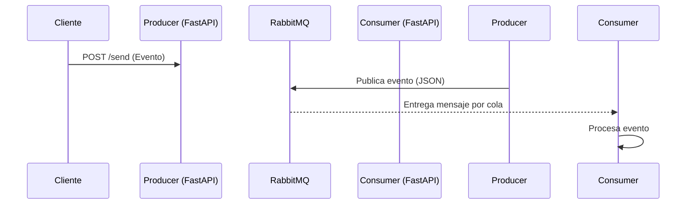

# RabbitMQ

---

##  1. ¿Qué es RabbitMQ?

RabbitMQ es un **message broker** (intermediario de mensajes) basado en el protocolo **AMQP (Advanced Message Queuing Protocol)**.

Permite la **comunicación desacoplada** entre productores y consumidores mediante colas, lo que lo hace ideal para sistemas distribuidos y microservicios.

---

##  2. Arquitectura de RabbitMQ

RabbitMQ se basa en los siguientes componentes:

| Componente   | Descripción                                                               |
| ------------ | ------------------------------------------------------------------------- |
| **Producer** | Envía mensajes al exchange.                                               |
| **Exchange** | Recibe mensajes del productor y los enruta a una o más colas.             |
| **Queue**    | Almacena los mensajes hasta que los consuma un consumidor.                |
| **Binding**  | Define la relación entre un exchange y una queue.                         |
| **Consumer** | Extrae mensajes de una cola para procesarlos.                             |
| **Broker**   | Es el servidor RabbitMQ que gestiona los exchanges, colas, bindings, etc. |

---

##  3. Diagrama básico de flujo (Mermaid)



---

##  4. Tipos de Exchanges

| Tipo        | Comportamiento                                                  | Caso de uso típico                   |
| ----------- | --------------------------------------------------------------- | ------------------------------------ |
| **direct**  | Enruta mensajes según una clave exacta (`routing_key`).         | Logs por nivel (`info`, `error`)     |
| **topic**   | Enruta usando patrones con `.` y `*` / `#`.                     | Microservicios con routing avanzado  |
| **fanout**  | Envía a **todas las colas** conectadas sin mirar `routing_key`. | Broadcasts (notificaciones globales) |
| **headers** | Usa headers personalizados para enrutar.                        | Casos avanzados (e.g. multilenguaje) |

---

##  5. Tabla comparativa de los exchanges

| Exchange | Usa `routing_key` | Patrón flexible | Multidestino | Performance |
| -------- | ----------------- | --------------- | ------------ | ----------- |
| direct   | ✅                 | ❌               | ❌            | Alta        |
| topic    | ✅                 | ✅               | ✅            | Media       |
| fanout   | ❌                 | ❌               | ✅            | Alta        |
| headers  | ❌                 | ❌ (usa headers) | ✅            | Baja        |

---

##  6. ¿Qué pasa con los mensajes?

### Ciclo de vida del mensaje:

1. **El productor publica un mensaje** en un exchange.
2. **El exchange enruta el mensaje** a una o más colas según su tipo y bindings.
3. **La cola almacena el mensaje** de forma persistente o temporal.
4. **Un consumidor extrae el mensaje**, lo procesa y lo **acknowledge** (confirma recepción).
5. Si el consumidor falla y no hace `ack`, el mensaje puede ser reenviado o redirigido a una `Dead Letter Queue`.

---

##  7. Casos de uso típicos

| Caso                        | Descripción                                         | Arquitectura recomendada   |
| --------------------------- | --------------------------------------------------- | -------------------------- |
| **Microservicios**          | Servicios desacoplados que se comunican por eventos | topic o direct             |
| **Sistemas de logging**     | Agregado de logs y métricas desde múltiples fuentes | fanout                     |
| **Procesamiento por lotes** | Recolecta mensajes y los procesa por lotes          | direct                     |
| **Notificaciones**          | Mensajes enviados a todos los usuarios conectados   | fanout                     |
| **ETL o colas de trabajo**  | Tareas largas gestionadas asincrónicamente          | direct + Dead Letter Queue |

---

## 🔁 8. Opciones adicionales

| Característica               | Explicación                                                           |
| ---------------------------- | --------------------------------------------------------------------- |
| **Durable queues**           | Las colas persisten tras reinicio del broker.                         |
| **Message persistence**      | El mensaje se guarda en disco hasta que se consuma.                   |
| **Ack & requeue**            | El consumidor puede rechazar y reencolar mensajes si falla.           |
| **Prefetch (QoS)**           | Limita la cantidad de mensajes sin procesar por consumidor.           |
| **Dead Letter Queues (DLQ)** | Redirige mensajes no entregados o rechazados para análisis posterior. |
| **Clustering**               | Permite replicación y balanceo en alta disponibilidad.                |
| **Federation/Shovel**        | Distribuye mensajes entre brokers en distintas regiones.              |

---

## 🧪 9. Comparativa de rendimiento

| Broker       | Throughput msg/s     | Latencia | Persistencia fuerte | Escalado                |
| ------------ | -------------------- | -------- | ------------------- | ----------------------- |
| **RabbitMQ** | Medio-Alto (20k–50k) | Baja     | Sí                  | Horizontal (clustering) |
| **Kafka**    | Muy Alto (100k–1M+)  | Mayor    | Sí (pero eventual)  | Particiones (sharding)  |

---

## 🧩 10. ¿RabbitMQ o Kafka?

| Criterio                   | RabbitMQ     | Kafka                           |
| -------------------------- | ------------ | ------------------------------- |
| Orden estricto de mensajes | ✅ (por cola) | ✅ (por partición)               |
| Persistencia y replay      | ❌ (limitado) | ✅ (hasta semanas)               |
| Tiempos reales (webhooks)  | ✅            | ❌ (buffering, latencia inicial) |
| Alto volumen de datos      | ❌            | ✅ (logs, eventos masivos)       |
| Complejidad de operaciones | Baja         | Media-Alta                      |

---

## 🧩 Relación con **FastAPI**

FastAPI no integra directamente colas, pero se conecta fácilmente con RabbitMQ usando:

* `pika` (básico, sincrónico)
* `aio_pika` (asíncrono)
* `kombu` (más abstracto, de Celery)

RabbitMQ permite a FastAPI:

* Desacoplar tareas largas (`background job`)
* Implementar **eventos de dominio** (event-driven)
* Integrar microservicios de forma robusta
* Cumplir con patrones **CQRS + Event Sourcing**

---

¿Te gustaría ahora una guía paso a paso para **crear una arquitectura CQRS usando FastAPI + RabbitMQ** o prefieres seguir con otros tipos de patrones como retry, DLQ o fanout?


---
# Explicación del proyecto 

Te explico de forma clara y profesional qué hace **RabbitMQ** en esta arquitectura FastAPI **productor-consumidor**, analizando ambos lados: **Producer** y **Consumer**.

---

## 🧩 Visión general

Este es un patrón clásico **Producer/Consumer** desacoplado usando **RabbitMQ** como *Message Broker*.



---

## 🟦 1. Productor (`producer/main.py`)

### ¿Qué hace RabbitMQ aquí?

RabbitMQ actúa como **intermediario**: almacena el mensaje enviado desde el FastAPI **productor** y lo deja en una **cola** para que el consumidor lo recoja cuando esté disponible.

### Análisis paso a paso

```python
connection = pika.BlockingConnection(pika.ConnectionParameters("rabbitmq"))
```

🔹 Establece una **conexión TCP** con el servidor RabbitMQ.
🔸 `"rabbitmq"` es el hostname del contenedor (resuelve por Docker DNS).

---

```python
channel = connection.channel()
channel.queue_declare(queue="mensajes")
```

🔹 Se abre un **canal** sobre la conexión (ligero, multiplexado).
🔸 `queue_declare` asegura que la cola `mensajes` **existe** (la crea si no está).
💡 Esto es **idempotente** y seguro para producción.

---

```python
channel.basic_publish(
    exchange="",  # uso del Default Exchange (tipo "direct")
    routing_key="mensajes",  # se enruta directamente a la cola "mensajes"
    body=evento.json().encode("utf-8")
)
```

🔹 Envía un mensaje al **exchange por defecto** (`""`), usando `routing_key="mensajes"`, lo que significa:
➡️ "**envíalo directamente a la cola `mensajes`**".
🔸 El cuerpo del mensaje es un JSON serializado del modelo `Evento`.

---

```python
connection.close()
```

🔹 Cierra la conexión una vez que el mensaje ha sido enviado.

---

## 🟩 2. Consumidor (`consumer/main.py`)

### ¿Qué hace RabbitMQ aquí?

RabbitMQ **almacena los mensajes** enviados por el productor y se los **entrega** al consumidor cuando este está activo y **suscrito** a la cola `mensajes`.

### Análisis paso a paso

```python
def connect_rabbitmq(retries=10, delay=3):
    ...
```

🔹 Función de **reintento automático** para conectarse al broker.
💡 Es útil si el contenedor RabbitMQ tarda en arrancar.

---

```python
channel = connection.channel()
channel.queue_declare(queue="mensajes")
```

🔹 Se asegura de que la cola `mensajes` esté disponible para **leer mensajes**.

---

```python
def callback(ch, method, properties, body):
    raw = body.decode()
    evento = Evento.parse_raw(raw)
    mensajes.append(evento)
```

🔹 Esta función se ejecuta **cada vez que llega un nuevo mensaje**.
🔸 Se parsea el JSON recibido a una instancia del modelo `Evento`.

---

```python
channel.basic_consume(queue="mensajes", on_message_callback=callback, auto_ack=True)
channel.start_consuming()
```

🔹 El consumidor se **suscribe a la cola** `mensajes` y entra en bucle esperando eventos.
🔸 Con `auto_ack=True` RabbitMQ **marca como entregado** el mensaje al instante, sin esperar confirmación explícita.

---

## 🧠 ¿Qué resuelve RabbitMQ en esta arquitectura?

| Problema resuelto     | Explicación técnica                                                    |
| --------------------- | ---------------------------------------------------------------------- |
| Acoplamiento temporal | El productor no necesita que el consumidor esté disponible.            |
| Balanceo de carga     | Puedes tener varios consumidores leyendo de la misma cola.             |
| Fiabilidad            | Los mensajes se almacenan hasta que se procesan (si son persistentes). |
| Tolerancia a fallos   | Si el consumidor cae, los mensajes se conservan.                       |
| Escalabilidad         | Puedes escalar consumidores horizontalmente según carga.               |

---

## 🛠️ Opciones que podrías añadir para producción

| Mejora                        | ¿Cómo hacerlo?                                                         |
| ----------------------------- | ---------------------------------------------------------------------- |
| **Persistencia del mensaje**  | `channel.queue_declare(queue="mensajes", durable=True)`                |
| **Durabilidad del mensaje**   | `basic_publish(..., properties=pika.BasicProperties(delivery_mode=2))` |
| **Retry y Dead Letter Queue** | Definir colas con parámetros de reintento y rechazo.                   |
| **Concurrency**               | Lanzar múltiples hilos o procesos consumidores.                        |

---

## ✅ Conclusión

RabbitMQ en esta arquitectura:

* Actúa como **buffer entre servicios**.
* Permite una comunicación **asíncrona, fiable y escalable**.
* Facilita la **desacoplamiento total** entre el backend que emite eventos y el que los procesa.

¿Quieres que integremos ahora colas duraderas, DLQ, o que esto funcione con múltiples consumidores y un dashboard de monitoreo?

---

### 🚀 Cómo usar:

```bash
docker-compose build
docker-compose up
```

### 🔁 Prueba en vivo:

1. Enviar mensaje:

```bash
curl -X POST http://localhost:8000/send \
  -H "Content-Type: application/json" \
  -d '{
        "id": "abc123",
        "tipo": "CREACION",
        "payload": {
            "usuario": "juan",
            "valor": 42
        }
      }'

```

2. Ver mensajes consumidos:

```bash
curl http://localhost:8001/messages

```

3. Acceder a RabbitMQ

`http://localhost:15672/`

# Opciones profesionales interesantes


## ✅ Parámetros completos de `basic_publish(...)`

```python
channel.basic_publish(
    exchange="",                     # Exchange al que se envía
    routing_key="mensajes",          # Clave de enrutamiento
    body=evento.json().encode(),     # Mensaje en binario
    properties=pika.BasicProperties( # Propiedades opcionales del mensaje
        content_type="application/json",
        delivery_mode=2,             # 2 = persistente
        headers={"source": "fastapi", "env": "dev"},
        correlation_id="12345",
        reply_to="respuesta_cola"
    ),
    mandatory=True                   # Si no hay cola asociada a routing_key, lanza excepción
)
```

---

## 🧾 Explicación de las principales opciones

| Parámetro     | ¿Qué hace?                                                                                 |
| ------------- | ------------------------------------------------------------------------------------------ |
| `exchange`    | Exchange donde se publica. Puede ser `""` (por defecto), `direct`, `fanout`, `topic`, etc. |
| `routing_key` | Clave que se usa para enrutar el mensaje (depende del tipo de exchange).                   |
| `body`        | El contenido del mensaje. Debe ser `bytes`.                                                |
| `properties`  | Un objeto `BasicProperties` que contiene metadatos del mensaje.                            |
| `mandatory`   | Si `True`, RabbitMQ devolverá un error si no encuentra una cola asociada.                  |

---

## 🎛️ `properties`: las opciones más útiles

Puedes configurar `pika.BasicProperties(...)` con muchos parámetros:

| Propiedad        | Ejemplo                            | ¿Para qué sirve?                                               |
| ---------------- | ---------------------------------- | -------------------------------------------------------------- |
| `delivery_mode`  | `2`                                | Hace el mensaje **persistente** (se guarda en disco).          |
| `content_type`   | `"application/json"`               | Identifica el tipo de contenido (útil para interoperabilidad). |
| `headers`        | `{"user": "admin", "env": "prod"}` | Headers personalizados. Se pueden usar para enrutar o auditar. |
| `correlation_id` | `"uuid"`                           | Útil para correlación entre productor y consumidor.            |
| `reply_to`       | `"response_queue"`                 | Usado en RPC para saber a qué cola responder.                  |
| `expiration`     | `"60000"`                          | Tiempo de vida del mensaje en milisegundos.                    |
| `priority`       | `5`                                | Requiere colas con soporte de prioridad (`x-max-priority`).    |

---

## 🧪 Ejemplo completo con propiedades personalizadas

```python
from pika import BasicProperties

channel.basic_publish(
    exchange="",
    routing_key="mensajes",
    body=evento.json().encode(),
    properties=BasicProperties(
        content_type="application/json",
        delivery_mode=2,  # persistente
        headers={"service": "producer", "version": "1.0"},
        correlation_id="abc-123",
        reply_to="respuesta_queue"
    )
)
```

---

## 🧠 ¿Cuándo usar estas opciones?

| Caso de uso real                          | ¿Qué usar?                         |
| ----------------------------------------- | ---------------------------------- |
| Garantizar que los mensajes no se pierdan | `delivery_mode=2`                  |
| Enviar respuestas a un RPC                | `correlation_id`, `reply_to`       |
| Auditar o enrutar por metadata            | `headers`                          |
| Dar prioridad a mensajes urgentes         | `priority`                         |
| Trabajar con múltiples tipos de datos     | `content_type`, `application/json` |

---

