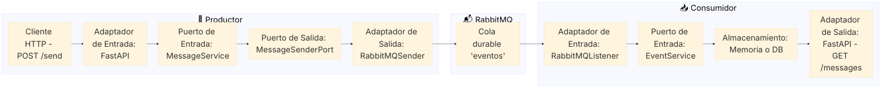

# Le vantamos servicios

1. Docker

```bash
docker compose up -d --build
```

2. Logs

```bash
docker compose logs -f
```

3. Accdemos a `http://localhost:8001/docs` quer sería el productor


4. Enviamos petición de productor:

```bash
curl -X 'POST' \
  'http://localhost:8001/send' \
  -H 'accept: application/json' \
  -H 'Content-Type: application/json' \
  -d '{
  "tipo": "mensaje",
  "id": "ID 1",
  "payload": {
    "additionalProp1": {"name" : "Jhon Doe"}
  }
}'
```


5. Verificamos colas de mensajes en consumidor

```bash
curl -X 'GET' \
  'http://localhost:8002/messages' \
  -H 'accept: application/json'
```


# Explicación hexagonal

Vamos a analizar paso por paso cómo fluye un mensaje (evento) desde que entra al **productor** hasta que es consumido por el **consumidor**, todo desde la **perspectiva de arquitectura hexagonal**, que organiza el sistema en tres capas:

1. **Dominio** (núcleo de reglas de negocio puras)
2. **Aplicación** (coordinación de casos de uso)
3. **Infraestructura + Interfaces** (adaptadores externos)

---

## 🧩 ARQUITECTURA HEXAGONAL APLICADA: FLUJO DEL MENSAJE

### 🔷 1. Entrada del evento en el Productor (FastAPI)

* **Componente:** `POST /send` (FastAPI)
* **Capa:** Adaptador de Entrada
* **Función:** Recibe un `Evento` desde un cliente HTTP (por ejemplo con `curl` o frontend).

```bash
curl -X POST http://localhost:8001/send \
 -H "Content-Type: application/json" \
 -d '{"tipo": "CREADO", "id": "abc123", "payload": {"clave": "valor"}}'
```

🔁 Aquí se transforma la petición HTTP a un objeto del dominio.

---

### 🔷 2. Paso al Servicio de Aplicación (Productor)

* **Componente:** `MessageService`
* **Capa:** Aplicación
* **Función:** Orquesta el caso de uso: toma el `Evento` recibido y se lo pasa a un puerto de salida (`MessageSenderPort`) sin conocer qué tecnología se usa para enviar.

```python
class MessageService:
    def __init__(self, sender: MessageSenderPort):
        self.sender = sender

    def enviar(self, evento: Evento):
        return self.sender.enviar_evento(evento)
```

🔁 Aquí se aplica inversión de dependencias: la lógica de aplicación depende de una **interfaz** (puerto de salida), no de un adaptador concreto.

---

### 🔷 3. Adaptador de Salida RabbitMQ (Productor)

* **Componente:** `RabbitMQSender`
* **Capa:** Infraestructura
* **Función:** Implementa el puerto `MessageSenderPort` usando la librería `pika` para conectarse a RabbitMQ y publicar el evento como mensaje JSON.

```python
channel.basic_publish(
    exchange="",
    routing_key="eventos",
    body=json.dumps(evento.dict())
)
```

🔁 Este adaptador concreta el envío. Si mañana usaras Kafka, sólo cambiarías este archivo.

---

### 🔷 4. RabbitMQ (Broker)

* **Componente:** `rabbitmq`
* **Capa:** Externa al hexágono
* **Función:** Cola durable que recibe los mensajes del productor y los mantiene hasta que el consumidor los procese.

---

## 🔶 A PARTIR DE AQUÍ: FLUJO EN EL CONSUMIDOR

### 🔷 5. Adaptador de Entrada RabbitMQ (Consumidor)

* **Componente:** `RabbitMQListener`
* **Capa:** Infraestructura
* **Función:** Escucha la cola `"eventos"`, transforma los datos recibidos en un objeto `Evento` y lo entrega al **puerto de entrada** del sistema.

```python
evento = Evento(**json.loads(body))
servicio.procesar_evento(evento)
```

🔁 Este adaptador actúa como un *listener* externo, equivalente a un controlador en REST.

---

### 🔷 6. Servicio de Aplicación (Consumidor)

* **Componente:** `EventService`
* **Capa:** Aplicación
* **Función:** Implementa el puerto `MessageReceiverPort` y decide qué hacer con el evento recibido (almacenarlo, emitir otro evento, etc.).

```python
self.mensajes.append(evento)
```

🔁 Nuevamente, el dominio no conoce nada de RabbitMQ. Solo recibe datos estructurados.

---

### 🔷 7. Consultar los eventos desde un endpoint REST (Consumidor)

* **Componente:** `GET /messages`
* **Capa:** Adaptador de Entrada
* **Función:** Permite ver los eventos procesados.

---

## ✅ CONCLUSIÓN: ¿Se respeta la Arquitectura Hexagonal?

**Sí, totalmente. Cada punto sigue estos principios:**

| Elemento                       | Capa              | Cumplimiento                                                              |
| ------------------------------ | ----------------- | ------------------------------------------------------------------------- |
| Dominio (`Evento`)             | Dominio           | Independiente de cualquier infraestructura                                |
| Puertos (`MessageSenderPort`)  | Aplicación        | Definen contrato para adaptadores, no dependen de implementación concreta |
| Servicios (`MessageService`)   | Aplicación        | Coordina sin saber detalles técnicos                                      |
| Adaptadores (`RabbitMQSender`) | Infraestructura   | Concretan acciones de entrada/salida del sistema                          |
| FastAPI                        | Adaptador Entrada | Traduce HTTP a dominio                                                    |
| RabbitMQListener               | Adaptador Entrada | Traduce mensajes de cola a dominio                                        |

> 🧠 **Resumen:** el dominio está completamente aislado, y todos los flujos de entrada/salida pasan por interfaces (puertos) que son implementadas por adaptadores.

¿Quieres que ahora empaquete este proyecto funcional completo con todo el código y configuración en un ZIP descargable?




---

### 🧠 Interpretación:

* **Hexágonos separados:** cada microservicio tiene su núcleo de lógica (aplicación + dominio) aislado por adaptadores.
* **Broker como frontera común:** RabbitMQ actúa como un medio neutral de comunicación.
* **Adaptadores REST y RabbitMQ:** permiten entrada/salida desacoplada.

