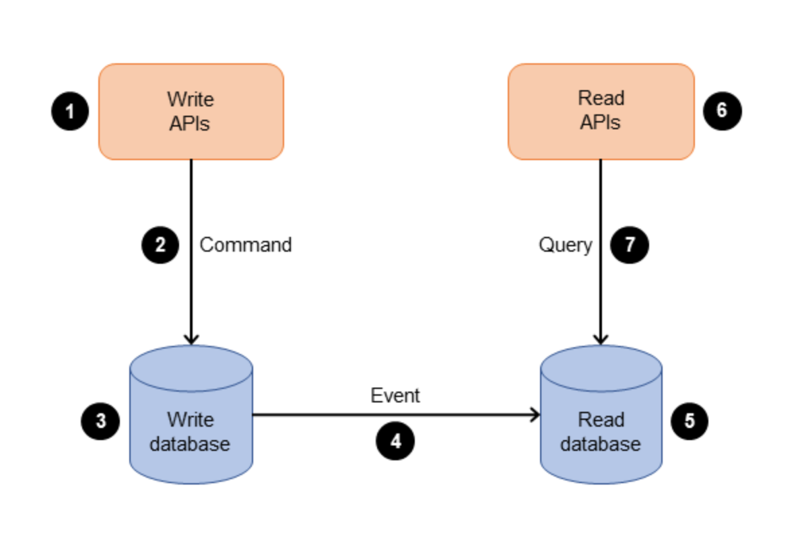

## CQRS: Separación de Responsabilidades de Comando y Consulta

El patrón **CQRS (Command Query Responsibility Segregation)** es un patrón arquitectónico que propone **separar la responsabilidad de la lectura (query) de la responsabilidad de la escritura (command)** en una aplicación. Esta separación permite optimizar cada una de estas operaciones de forma independiente, lo que puede resultar en un sistema más escalable, flexible y fácil de mantener.

---

### Componentes Clave del Patrón CQRS

* **Command (Comando)**: Representa una operación de **escritura o modificación de datos** en el sistema. Los comandos son los responsables de realizar cambios en el estado del sistema. Piensa en acciones como "crear un nuevo usuario", "actualizar el precio de un producto" o "eliminar un pedido".
* **Query (Consulta)**: Representa una operación de **lectura o consulta de datos** en el sistema. Las consultas solo recuperan datos sin modificarlos. Ejemplos incluyen "obtener la lista de todos los productos" o "buscar un cliente por su ID".
* **Modelo de Datos de Lectura (Read Model)**: Es un modelo de datos **optimizado específicamente para operaciones de lectura y consulta**. Puede estar diseñado para satisfacer las necesidades de consulta de la aplicación y a menudo contiene datos agregados o precalculados para mejorar el rendimiento.
* **Modelo de Datos de Escritura (Write Model)**: Es un modelo de datos **optimizado para operaciones de escritura y modificación**. Puede ser distinto del modelo de lectura y se optimiza para que las operaciones de escritura sean eficientes y consistentes.

---

### Características y Ventajas del Patrón CQRS

Has identificado muy bien los beneficios, que son la clave para entender por qué se usa CQRS:

* **Optimización y Escalabilidad**: Al dividir las operaciones de lectura (consultas) de las de escritura (comandos), se facilita la **escalabilidad independiente** de cada lado. Si tienes muchas más lecturas que escrituras, puedes escalar tu infraestructura de lectura sin afectar las operaciones de escritura.
* **Mejora del Rendimiento**: Se pueden aplicar técnicas de optimización específicas para cada operación, lo que lleva a un **mejor rendimiento general** y una experiencia de usuario más fluida.
* **Modelado de Dominio Rico**: CQRS permite un modelado de dominio más expresivo, ya que cada modelo de datos puede diseñarse específicamente para las necesidades de las operaciones que soporta.
* **Flexibilidad en la Evolución**: Cada parte del sistema puede evolucionar de manera independiente, facilitando la introducción de cambios sin afectar a otras partes.
* **Seguridad y Control**: Permite aplicar un **control de acceso más granular**, mejorando la seguridad del sistema.
* **Claridad en el Diseño**: La separación de responsabilidades hace que el **diseño del sistema sea más claro y comprensible**.

---

### Desafíos del Patrón CQRS

Aunque es potente, CQRS presenta sus propias complejidades:

* **Complejidad de Implementación**: Separar las responsabilidades puede introducir una **mayor complejidad** en el diseño y la implementación, especialmente en sistemas distribuidos.
* **Consistencia de Datos**: Mantener la **consistencia entre los modelos de datos de lectura y escritura** puede ser un desafío, sobre todo en sistemas distribuidos. Esto a menudo implica la **consistencia eventual**.
* **Coherencia de la Interfaz de Usuario**: Al haber una posible consistencia eventual, la interfaz de usuario debe gestionarse para asegurar una experiencia coherente.
* **Comunicación entre Componentes**: La comunicación entre los componentes de lectura y escritura puede ser compleja y a menudo requiere el uso de **patrones de mensajería**.
* **Gestión de Transacciones**: Puede volverse más compleja debido a la separación de modelos y operaciones.
* **Mayor Overhead (Sobrecarga)**: Puede introducir una mayor sobrecarga debido a la necesidad de gestionar y sincronizar modelos de datos separados.

---

### Flujo de Procesos en CQRS (según AWS)

[CQRS en AWS](https://aws.amazon.com/es/blogs/aws-spanish/cqrs-en-aws-sincronizando-los-servicios-de-command-y-query-con-el-estandar-transactional-outbox-la-tecnica-transaction-log-tailing-y-el-amazon-dynamodb-streams/)

Tu descripción del flujo de procesos es muy clara y ayuda a entender cómo funciona en la práctica:

1.  La empresa interactúa con la aplicación **enviando comandos a través de una API**. Estos comandos son acciones como crear, actualizar o eliminar datos.
2.  La aplicación procesa el **comando entrante desde el lado de los comandos**. Esto incluye validar, autorizar y ejecutar la operación.
3.  La aplicación **persiste los datos del comando en la base de datos de escritura (comandos)**.
4.  Una vez que el comando se almacena en la base de datos de escritura, **se activan eventos** para actualizar los datos en la **base de datos de lectura (consulta)**. Aquí es donde entra en juego la consistencia eventual.
5.  La **base de datos de lectura (consulta) procesa y persiste los datos**. Estas bases de datos están diseñadas para optimizarse para requisitos de consulta específicos.
6.  La empresa interactúa con las **APIs de lectura para enviar consultas** a la parte de consultas de la aplicación.
7.  Finalmente, la aplicación procesa la consulta entrante en el lado de la consulta y **recupera los datos de la base de datos de lectura**.

En resumen, el patrón CQRS es una técnica valiosa para mejorar el rendimiento, la escalabilidad y la flexibilidad de un sistema al separar las operaciones de lectura y escritura. Sin embargo, también introduce desafíos adicionales en términos de complejidad y consistencia de datos, que deben considerarse cuidadosamente al aplicar este patrón en un sistema.




---

## 🆚 Escenario sin CQRS (todo junto)

Supongamos que tienes una clase o endpoint que **crea y consulta pedidos**:

```python
# Sin CQRS (modelo compartido)

class Pedido(Base):
    id = Column(Integer, primary_key=True)
    usuario_id = Column(Integer)
    producto = Column(String)
    cantidad = Column(Integer)
    total = Column(Float)
    estado = Column(String)

@app.post("/pedidos")
def crear_pedido(data: dict):
    total = data["cantidad"] * 10
    pedido = Pedido(**data, total=total)
    db.add(pedido)
    db.commit()
    return pedido

@app.get("/pedidos/{id}")
def obtener_pedido(id: int):
    pedido = db.query(Pedido).get(id)
    return pedido
```

### ❌ Problemas aquí:


1. No hay separación de responsabilidades: todo mezclado en el controlador. Acoplamiento.
2. En testing tienes que hacer mocking
3. Escalabilidad horizontal en escrituras y lecturas

---

## Mismo ejemplo con CQRS

```python
# COMANDO
class CrearPedidoCommand(BaseModel):
    usuario_id: int
    producto: str
    cantidad: int

# DTO
class PedidoDTO(BaseModel):
    id: int
    usuario_id: int
    producto: str
    cantidad: int
    total: float
    estado: str
    model_config = {"from_attributes": True}

# HANDLER DE COMANDO
class CrearPedidoHandler:
    def __init__(self, repo):
        self.repo = repo

    def execute(self, command: CrearPedidoCommand):
        total = command.cantidad * 10
        pedido = Pedido(..., total=total, estado="pendiente")
        return self.repo.save(pedido)

# HANDLER DE QUERY
class GetPedidoHandler:
    def __init__(self, repo):
        self.repo = repo

    def execute(self, pedido_id: int):
        pedido = self.repo.get_by_id(pedido_id)
        return PedidoDTO.from_orm(pedido)
```

---

## 🎯 ¿Qué ventaja concreta tiene CQRS aquí?

| Ventaja                     | Sin CQRS                                 | Con CQRS                                                        |
| --------------------------- | ---------------------------------------- | --------------------------------------------------------------- |
| **Separación lógica**       | ❌ Mezcla todo                            | ✅ Comando y consulta separados                                  |
| **Evolución del modelo**    | ❌ Riesgo de romper todo                  | ✅ Lectura y escritura se cambian por separado                   |
| **Escalabilidad**           | ❌ Todo en el mismo endpoint/modelo       | ✅ Puedes optimizar solo la lectura o solo escritura             |
| **Testing**                 | ❌ Difícil testear flujo sin side-effects | ✅ Handlers testables por separado                               |
| **Read Models optimizados** | ❌ No puedes denormalizar sin romperlo    | ✅ Puedes hacer DTOs de lectura totalmente adaptados al frontend |

---

## Conclusión práctica

En proyectos pequeños, **no usar CQRS puede ir bien**, pero cuando:

* tienes reglas de negocio complejas,
* quieres optimizar la lectura,
* trabajas con equipos distintos,
* o migras hacia microservicios,

➡️ **CQRS te da orden, claridad y control.**

