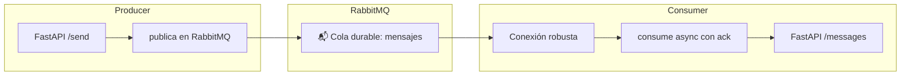

# 🐇 Productor/Consumidor con RabbitMQ y FastAPI (aio_pika)

Este proyecto implementa una arquitectura **Producer/Consumer** usando `FastAPI` y `RabbitMQ`, con comunicación asíncrona basada en colas de mensajes. La librería utilizada para integrarse con RabbitMQ es [`aio_pika`](https://aio-pika.readthedocs.io/en/latest/), la cual soporta conexiones asíncronas y robustas.

---

## 🔧 Tecnologías utilizadas

| Tecnología | Propósito                        |
|-----------|----------------------------------|
| FastAPI   | Framework web para APIs REST     |
| RabbitMQ  | Broker de mensajería AMQP        |
| aio_pika  | Cliente asíncrono para RabbitMQ  |
| Docker    | Contenedores para servicios      |
| Uvicorn   | ASGI server para FastAPI         |

---

## 📦 Estructura del sistema



---

## 📝 Descripción del flujo

### Productor

* Expone un endpoint `POST /send` que recibe un modelo `Evento` en formato JSON.
* Se conecta a RabbitMQ usando `aio_pika.connect_robust`.
* Declara la cola `mensajes` como **durable**.
* Publica el evento como `Message` marcado con `delivery_mode=PERSISTENT`.

📦 Código clave:

```python
message = aio_pika.Message(
    body=evento.json().encode(),
    delivery_mode=aio_pika.DeliveryMode.PERSISTENT
)
```

---

### Consumidor

* Se conecta a RabbitMQ al iniciar (`startup_event`).
* Usa `prefetch_count=1` para recibir mensajes uno a uno.
* Declara la misma cola `mensajes` como durable.
* Registra un `callback()` para procesar los mensajes.
* Cada mensaje se **acknowledgea automáticamente** si no falla (`async with message.process()`).
* Simula una demora con `await asyncio.sleep(10)` para observar los estados `unacked` en la UI.

📦 Código clave:

```python
async with message.process():
    data = json.loads(message.body.decode())
    evento = Evento(**data)
    mensajes.append(evento)
```

---

## ✅ Pruebas con `curl`

### 1. Enviar un evento desde el productor

```bash
curl -X POST http://localhost:8000/send \
  -H "Content-Type: application/json" \
  -d '{"id": 1, "tipo": "registro", "payload": {"usuario": "admin"}}'
```

### 2. Consultar mensajes recibidos en el consumidor

```bash
curl http://localhost:8001/messages
```

---

## 📊 UI de RabbitMQ

Accede al panel en: [http://localhost:15672](http://localhost:15672)
**Usuario:** `guest`
**Contraseña:** `guest`

### En la pestaña *Queues* busca `mensajes`:

| Campo       | Significado                              |
| ----------- | ---------------------------------------- |
| **Ready**   | Mensajes listos para consumir            |
| **Unacked** | Entregados pero aún no confirmados (ACK) |
| **Total**   | Suma de Ready + Unacked                  |

> Puedes ver los mensajes `Unacked` si el consumidor está en medio de la ejecución del `callback`.

---

## 🧪 Comprobaciones adicionales

* **Durabilidad**: Detén los contenedores y verifica que los mensajes pendientes persisten (`delivery_mode=2` y `queue.durable=True`).
* **Redelivery**: Si el consumidor lanza una excepción dentro del `callback`, el mensaje no será acked y podrá reenviarse.


---

## 🧠 Casos de uso típicos de esta arquitectura

| Escenario                          | Justificación del uso de RabbitMQ                 |
| ---------------------------------- | ------------------------------------------------- |
| Comunicación entre microservicios  | Desacoplamiento y tolerancia a fallos             |
| Procesamiento de eventos diferidos | Permite procesamiento lento sin bloquear emisores |
| Escalado de consumidores           | Rabbit distribuye mensajes equitativamente        |
| Registro de auditoría asíncrono    | Registra sin impactar al flujo principal          |

---

Por supuesto. Vamos a explicar en profundidad el punto **9.3 del curso: *Conceptos de Topic, Exchange, Queue y Binding***, para que cualquier desarrollador entienda cómo funciona la **arquitectura de mensajería de RabbitMQ (AMQP 0-9-1)**, con ejemplos visuales, analogías y un caso realista.

---

## 🧠 ¿Qué es AMQP y por qué importa?

**AMQP (Advanced Message Queuing Protocol)** es el protocolo que usa RabbitMQ. Su objetivo es **desacoplar productores y consumidores**. Así, en lugar de que una aplicación le hable directamente a otra, **le deja un mensaje en una cola**.

Esto es como una **bandeja de entrada de correo**: el productor mete el sobre, y el consumidor lo recoge cuando esté listo.

---

## 🧱 Componentes Fundamentales

| Componente      | Descripción técnica                                                                        | Analogía                         |
| --------------- | ------------------------------------------------------------------------------------------ | -------------------------------- |
| **Producer**    | Publica (envía) mensajes a un exchange                                                     | Emisor del mensaje               |
| **Exchange**    | Recibe mensajes y decide **cómo y a qué cola(s)** enrutarlo                                | Centralita de correos            |
| **Queue**       | Almacena mensajes en espera de que los consuma alguien                                     | Bandeja o buzón de entrada       |
| **Consumer**    | Escucha una cola y procesa los mensajes que hay en ella                                    | Receptor que abre los sobres     |
| **Binding**     | Regla que conecta un exchange a una queue usando una clave de enrutamiento (`routing_key`) | Norma de distribución de correos |
| **Routing Key** | Etiqueta que lleva cada mensaje para decir a dónde va                                      | Dirección en el sobre            |

---

## 🔁 Tipos de Exchanges y su comportamiento

| Tipo de Exchange | ¿Qué hace?                                                                     | ¿Cuándo usarlo?                     |
| ---------------- | ------------------------------------------------------------------------------ | ----------------------------------- |
| `direct`         | Enruta mensajes a la(s) cola(s) con **routing\_key exacta**                    | Notificaciones específicas por tipo |
| `fanout`         | Enruta mensajes a **todas las colas enlazadas**, sin importar el `routing_key` | Logs o eventos globales             |
| `topic`          | Usa `routing_key` con patrones (`*`, `#`)                                      | Subscripción por temas jerárquicos  |
| `headers`        | Enruta según las cabeceras del mensaje, no por `routing_key`                   | Casos muy dinámicos o con metadatos |

---

## 🔎 Detalle de Topic Exchange (más flexible y potente)

### 🧶 Reglas de Routing Key en `topic`

* `.` es el separador de niveles (jerarquías).
* `*` sustituye **un nivel exacto**.
* `#` sustituye **uno o más niveles**.

| Routing Key       | Binding Key | ¿Coincide? |
| ----------------- | ----------- | ---------- |
| `user.created`    | `user.*`    | ✅          |
| `user.created`    | `user.#`    | ✅          |
| `user.created.eu` | `user.*`    | ❌          |
| `user.created.eu` | `user.#`    | ✅          |
| `order.cancelled` | `user.*`    | ❌          |

---

## 🎨 Diagrama Visual en Mermaid

```mermaid
flowchart TD
    subgraph 📨 Producer
        A[FastAPI POST /send]
    end

    subgraph 📦 Exchange (type=topic)
        B((mi_exchange))
    end

    subgraph 📥 Queues
        C[Queue: user_events]
        D[Queue: order_events]
    end

    A -->|routing_key="user.created"| B
    B -->|bind: "user.*"| C
    B -->|bind: "order.*"| D
    C --> E[Consumer: ServicioUsuarios]
    D --> F[Consumer: ServicioPedidos]
```

---

## 🔧 Ejemplo  con `aio_pika`

```python
# Productor
await exchange.publish(
    aio_pika.Message(body=b"evento usuario creado"),
    routing_key="user.created"
)

# Binding de la cola al exchange
await queue.bind(exchange, routing_key="user.*")
```

---

## 🧪 Casos de uso reales

| Escenario de microservicio            | Exchange Type | Routing Key       | Descripción breve                                |
| ------------------------------------- | ------------- | ----------------- | ------------------------------------------------ |
| Microservicio de usuarios y auditoría | `topic`       | `user.created`    | Un evento que se enruta a múltiples consumidores |
| Logs de sistema centralizados         | `fanout`      | *(ignorado)*      | Broadcast a múltiples servicios de logging       |
| Proceso de pago específico            | `direct`      | `payment.success` | Mensajes exactos solo para una cola              |
| Eventos multiregión con metadatos     | `headers`     | *(sin clave)*     | Se enruta por cabeceras como `"region": "EU"`    |

---


