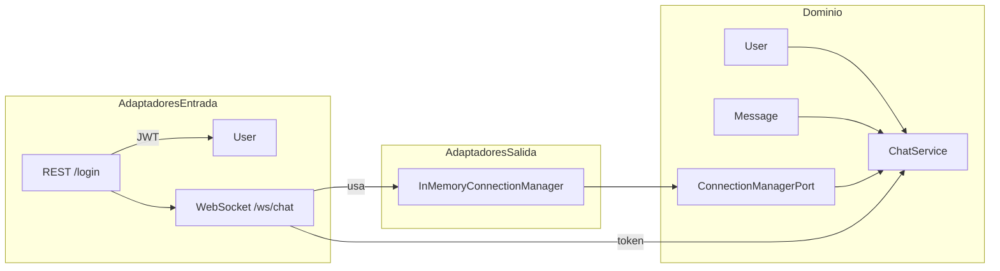

# 🔹 Reto - Chat de Notificaciones con WebSockets y Autenticación JWT (Arquitectura Hexagonal)

| Ítem               | Detalles                                                                                           |
| ------------------ | -------------------------------------------------------------------------------------------------- |
| 🕒 **Duración**    | 2–3 h                                                                                              |
| 🎯 **Objetivo**    | Aplicar arquitectura hexagonal en un microservicio de chat por WebSocket autenticado               |
| 🧠 **Temas**       | Tema 6 y 10: Arquitectura Hexagonal + WebSockets + JWT                                             |
| ⚙️ **Tecnologías** | FastAPI, Pydantic, python-jose, WebSocket, pytest                                                  |
| 📁 **Entregable**  | Servicio funcional, desacoplado y con tests, capaz de gestionar sesiones de WebSocket autenticadas |
| 🧩 **Repositorio** | `reto10-chat-ws-auth`                                                                              |

---

## Enunciado del Reto

Tu misión es diseñar un **microservicio de chat de notificaciones internas** usando:

* **WebSockets autenticados con JWT**
* Arquitectura **hexagonal**
* Almacenamiento **en memoria** para mantener usuarios conectados

---

## Requisitos funcionales

1. **Login con usuario/contraseña**, devuelve un JWT. (SSL)
2. **Conexión WebSocket autenticada** con ese JWT (query param). (WSS)
3. Los usuarios pueden:

   * Enviar mensajes a todos los conectados (`broadcast`)
   * Recibir mensajes en tiempo real desde el servidor
4. Solo usuarios con el claim `"role": "admin"` pueden enviar mensajes de broadcast.

---

## Arquitectura Hexagonal

```
reto10-chat-ws-auth/
├── app/
│   ├── domain/               # Entidades y servicios
│   │   ├── models.py         # Entidad Usuario y Mensaje
│   │   ├── services.py       # Lógica: gestión conexiones, envío
│   │   └── ports.py          # Puertos entrada y salida
│   │
│   ├── infrastructure/       # Repositorio en memoria de conexiones activas
│   │   └── connection_repo.py
│   │
│   ├── interfaces/           # Adaptador HTTP y WebSocket
│   │   ├── auth_http.py
│   │   └── ws_chat.py
│   │
│   └── main.py               # Inyección de dependencias
├── tests/
│   └── test_chat.py
├── requirements.txt
├── Makefile
└── README.md
```

---


## OBJETIVO FUNCIONAL

Crear un microservicio que:

1. Permite a un usuario autenticarse vía `/login` y recibir un JWT.
2. Permite conectar a un WebSocket autenticado mediante `token` en la URL.
3. Gestiona múltiples conexiones activas.
4. Permite a usuarios con rol `admin` enviar mensajes a **todos los usuarios conectados**.

---

##  DIAGRAMA RESUMIDO (hexagonal)



---

## CAPAS Y LÓGICA

### 1. **Dominio**

#### `models.py`

Define las entidades básicas:

```python
@dataclass
class User:
    username: str
    role: str

@dataclass
class Message:
    sender: str
    content: str
```

#### `ports.py`

Define el **puerto de salida** (interfaz esperada por el dominio):

```python
class ConnectionManagerPort(Protocol):
    def connect(self, user: User, websocket: WebSocket): ...
    def disconnect(self, user: User): ...
    async def broadcast(self, message: Message): ...
```

#### `services.py`

Implementa la lógica del negocio: si el usuario tiene permiso, envía el mensaje.

```python
class ChatService:
    def handle_message(self, user, text):
        if user.role != "admin":
            return
        await self.connection_manager.broadcast(...)
```

---

### 2. **Adaptador de entrada: WebSocket**

Archivo: `ws_chat.py`

* Lee el token JWT desde la URL.
* Verifica y decodifica con `jose.jwt.decode(...)`.
* Crea un objeto `User` con sus claims.
* Conecta el WebSocket a la conexión en memoria.
* Escucha texto → lo pasa al servicio de dominio.

---

### 3. **Adaptador de salida: Repositorio de conexiones**

Archivo: `infrastructure/connection_repo.py`

* Usa un diccionario `Dict[str, WebSocket]` para guardar los sockets activos.
* Implementa el puerto `ConnectionManagerPort`.
* Método `broadcast()` recorre los WebSockets y les envía texto.

---

## AUTENTICACIÓN y AUTORIZACIÓN

* JWT generado en `/login` incluye claims: `"sub"` (usuario) y `"role"` (admin o user).
* WebSocket los extrae del token y decide si el usuario tiene permisos para enviar.

---

## Puntos clave para implementar correctamente

| Componente              | Rol clave                                                           |
| ----------------------- | ------------------------------------------------------------------- |
| `ChatService`           | Lógica de negocio: quién puede enviar, cómo se construye el mensaje |
| `ConnectionManagerPort` | Abstracción del almacenamiento de WebSockets activos                |
| `InMemoryConnectionMgr` | Implementación simple para testing sin Redis ni DB                  |
| `ws_chat.py`            | Controla el ciclo de vida del WebSocket y lo conecta al dominio     |
| `auth_http.py`          | Genera JWT de forma controlada y segura                             |

---

## Cómo extenderlo

* Sustituir `InMemoryConnectionManager` por uno que use **Redis Pub/Sub** o **WebSocket Manager global**.
* Añadir **canales** de chat: cada usuario se une a un canal y solo recibe mensajes de ese canal.
* Emitir **eventos del sistema** (`user_joined`, `user_left`).
* Guardar mensajes en DB para tener **historial persistente**.

---


## Bonus opcional

* Añadir endpoint `GET /users/connected` para consultar usuarios conectados (solo admin).
* Emitir evento `"user_joined"` cuando alguien se conecta.

